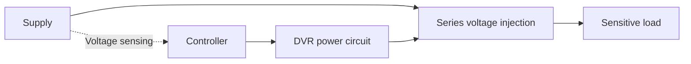

# EPQ Notes

# Electrical Power Quality — Midsem Notes

Study **Priority 0 first**, followed by the reliability numerical and the remaining **Priority 1** theory. Then prepare the repeated **Priority 2** applications and remedy table. **Priority 3** is kept short for the older-paper questions.

## Priority 0 — Topics explicitly emphasized by Sir

### 1. Introduction to power quality

An electrical supply must do more than deliver energy: it must allow the connected equipment to work correctly. A short voltage disturbance may reset a controller or trip a drive, stopping a production process even though the supply returns almost immediately. **Power quality (PQ)** therefore concerns both the electrical supply and the response of the equipment using it.

Modern systems contain many power-electronic devices, such as adjustable-speed drives, computer power supplies, UPS systems and renewable-energy converters. A **nonlinear load** draws current that does not follow the applied voltage proportionally. Thus, even a sinusoidal voltage can produce distorted current containing harmonics.

Solid-state equipment creates a two-sided problem: it can introduce distortion into the system and can itself be sensitive to disturbances. Microprocessors, computers, digitally controlled machines and industrial controls particularly need suitable voltage and continuity of supply.

PQ matters throughout transmission, distribution and utilization. Faults and switching in the network can disturb consumer voltage, while a customer’s nonlinear or rapidly varying load can affect other consumers through the common supply. The practical consequences include equipment malfunction, heating, data loss, production loss and reduced equipment life.

### 2. Power quality, voltage quality, current quality and PCC

**Power quality is the interaction of electrical power with equipment that determines whether the power is fit for the consumer’s devices.** It can also be described through deviations of voltage or current from the normal sinusoidal waveform. Together, these descriptions connect the electrical disturbance with its practical consequence.

| Term | Meaning |
| --- | --- |
| **Voltage quality** | How closely the supplied voltage follows the required waveform and operating conditions. It describes the quality of the utility’s delivered electrical product. |
| **Current quality** | How closely the current follows an ideal sinusoidal waveform. Nonlinear loads can draw poor-quality current even from a good-quality voltage supply. |
| **Continuity of supply** | The ability to provide satisfactory service nearly continuously, with few interruptions over time. |
| **Point of Common Coupling (PCC)** | The common connection point in the supply network shared by multiple consumer loads. Disturbances from one load can propagate through this point to others. |

Voltage quality and continuity are related but different. A supply can remain connected throughout a voltage sag, yet its voltage may be unsuitable for a sensitive load. Conversely, an interruption is a direct failure of continuity.

For voltage-event definitions, **RMS voltage** represents the effective AC voltage. **Per-unit voltage (pu)** expresses this relative to nominal voltage:

$$
V_{\mathrm{pu}}=\frac{V_{\mathrm{RMS}}}{V_{\mathrm{nominal}}}.
$$

Both voltages use the same units. Thus, 1 pu is nominal voltage and 0.7 pu means **70% voltage remaining**, equivalent to a 30% reduction.

### 3. Impulsive and oscillatory transients

A **transient** is a sudden, non-power-frequency change in the steady-state voltage or current. It is a brief disturbance superimposed on the normal waveform, commonly associated with lightning or switching.

An **impulsive transient** has one predominant polarity: a sharp positive or negative excursion with a very fast rise and short duration. Lightning is the main example. Other causes include inductive-load switching, utility fault clearing, electrostatic discharge and poor grounding. The high peak can damage electronic components or corrupt stored data.

An **oscillatory transient** alternates in polarity about the undisturbed waveform. System inductance and capacitance exchange stored energy after a switching event, producing a rapidly oscillating disturbance that decays as energy is dissipated. Capacitor-bank, line and inductive-load switching are common causes. Its frequency is associated with the circuit’s natural response, rather than necessarily being a multiple of the supply frequency.

Oscillatory transients can also damage equipment, corrupt data and reduce equipment life. The essential difference is the **shape and polarity of the transient component**.

| Impulsive transient | Oscillatory transient |
| --- | --- |
| Predominantly unidirectional. | Alternates in positive and negative directions. |
| A sharp spike with rapid rise and decay. | A burst of ringing with a decaying envelope. |
| Lightning is a representative cause. | Capacitor or line switching is a representative cause. |

**Waveforms:** Draw voltage against time with a normal sine wave as reference. For an impulse, add one narrow, tall spike and label its peak and short duration. For an oscillatory transient, add several rapid oscillations around the normal waveform with decreasing amplitude. The impulse may be negative as well as positive.

### 4. Voltage sag

A **voltage sag**, or voltage dip, is a temporary reduction in RMS voltage to **0.1–0.9 pu**, lasting **0.5 cycle to 1 minute**. The supply remains present, but its voltage falls below the normal operating level.

A sag commonly starts when the current drawn from the network suddenly increases. Because the supply network has impedance, the increased current produces a greater voltage drop before the load:

$$
\text{Fault or large starting current}
\rightarrow \text{greater network voltage drop}
\rightarrow \text{lower load voltage}.
$$

Typical causes are short-circuit faults, large-motor starting, sudden connection of a heavy load and transformer energization. During a line-to-ground fault, the sag may continue until protective equipment clears the fault. Even a refrigerator or air-conditioner starting can cause a local sag.

Contactors may drop out, adjustable-speed drives (ASDs) may trip, and programmable logic controllers (PLCs) or process controls may malfunction. The resulting production loss can last much longer than the electrical disturbance.

**Waveform:** Draw normal sinusoidal voltage, several cycles of smaller amplitude, and recovery to normal. Label the remaining RMS voltage and sag duration. Keep the sine wave visible during the sag; a nearly flat zero-voltage interval represents an interruption.

### 5. Under-voltage and its difference from sag

**Under-voltage** is a reduction of the power-frequency AC voltage below **90% of nominal for more than 1 minute**. It is a sustained low-voltage condition; “brownout” is an older term.

Heavy loading and inadequate voltage regulation can maintain a large network voltage drop. Under-voltage may also follow load switching, faults or capacitor de-energization. The classification depends on how long the reduced voltage persists, rather than on the cause alone.

Motors may heat and incur increased losses, while nonlinear loads such as computer power supplies may fail to operate. A persistent condition calls attention to the supply, loading or equipment configuration.

| Voltage sag | Under-voltage |
| --- | --- |
| 0.1–0.9 pu remaining voltage. | Below 0.9 pu, excluding the near-zero interruption condition. |
| 0.5 cycle to 1 minute. | More than 1 minute. |
| Commonly a fault or starting-current event. | A sustained loading or regulation problem. |

For an under-voltage sketch, extend the reduced-amplitude portion beyond the one-minute boundary.

### 6. Voltage swell

A **voltage swell** is a temporary increase in RMS voltage to **1.1–1.8 pu**, lasting **0.5 cycle to 1 minute**. The upper magnitude depends on the duration subclass.

A sudden reduction in load reduces the voltage drop in the supply network and can raise the load voltage. Large-load disconnection and capacitor switching are therefore common causes. A single-line-to-ground fault can also cause a temporary voltage rise on the unfaulted phases. A high-impedance neutral is another possible cause.

The increased voltage stresses insulation, semiconductors and power-supply components. It may cause data errors, control problems, overheating or equipment shutdown. Repeated exposure can gradually degrade insulation and contacts.

| Swell subclass | RMS magnitude | Duration |
| --- | --- | --- |
| Instantaneous | 1.1–1.8 pu | 0.5–30 cycles |
| Momentary | 1.1–1.4 pu | 30 cycles–3 s |
| Temporary | 1.1–1.2 pu | 3 s–1 min |

**Waveform:** Draw several cycles of increased sinusoidal amplitude between normal-voltage portions. Label the elevated RMS voltage and event duration. A swell lasts across cycles; it is not a narrow transient spike.

### 7. Over-voltage and its difference from swell

**Over-voltage** is a power-frequency AC voltage above **110% of nominal for more than 1 minute**. It is a sustained high-voltage condition.

Incorrect transformer tap settings can maintain excessive voltage. A setting that compensates for heavy-load voltage drop may produce over-voltage after much of the load is disconnected. Capacitor energization can also raise the voltage.

The consequences include insulation and component stress, overheating, nuisance breaker operation and appliance damage.

| Voltage swell | Over-voltage |
| --- | --- |
| A short increase above 1.1 pu. | A sustained increase above 1.1 pu. |
| 0.5 cycle to 1 minute. | More than 1 minute. |
| Often associated with switching or an unfaulted phase during a fault. | Often associated with tap settings, light loading or sustained regulation problems. |

The waveform shape is similar, but the elevated-amplitude region of an over-voltage lasts beyond one minute.

### 8. Voltage fluctuation and flicker

**Voltage fluctuation** is a systematic or random variation of the voltage envelope caused by changing load demand. The envelope describes how the amplitude of the underlying AC waveform changes with time.

Typical voltage fluctuations are small variations of approximately **95–105% of nominal**, usually at an envelope frequency **below 25 Hz**. This is the rate of amplitude variation; it does not mean that a 50 Hz supply has become a 25 Hz supply.

Rapid changes in real and reactive power produce changing current and hence changing network voltage drop. **Arc furnaces** are a major example. Arc welders, frequent motor starts, cyclic motor drives and large speed changes can produce similar effects.

**Flicker is the visible variation in lamp brightness caused by voltage fluctuation.** Fluctuation is the electrical phenomenon; flicker is its lighting effect. It can cause irritation and discomfort. Fluctuating supply voltage can also cause data loss, system halts and protection malfunction.

**Waveform:** Draw a sine wave whose amplitude repeatedly grows and shrinks. Label the changing envelope and its repetition period. Unlike a single sag, the amplitude variation is repeated or irregular over time.

### 9. Short and long interruptions

An **interruption** is a failure of supply continuity in which the voltage becomes nearly zero. On the magnitude-duration chart, the interruption region is **below 0.1 pu**. Complete loss of voltage may affect one or more phase conductors.

A **short interruption** lasts up to the one-minute boundary. A temporary fault may make an automatic recloser open the circuit and restore it after a short interval. Lightning-related faults and insulation flashover are examples. PLCs, ASDs and data-storage systems can stop or malfunction during the loss of supply.

A **sustained or long interruption** lasts **more than 1 minute**. Causes include system faults, human error and malfunction of protective equipment. Equipment and production remain stopped until supply is restored.

**Waveform:** Show normal sinusoidal voltage, a nearly zero interval, and restoration. Label the interruption duration. For a long interruption, use a time-axis break if needed to show the extended outage clearly.

> **Caution:** For the exam, use the magnitude–duration classification below: short interruptions last up to 1 minute, while sustained interruptions last more than 1 minute.
> 

### 10. Notching

**Notching** is a periodic voltage disturbance that produces small cuts or missing portions in the waveform during successive half-cycles. It is classified as waveform distortion because it repeats during normal operation of the disturbing equipment.

It is associated with power-electronic converters, variable-speed drives, dimmers and arc welders. These repeated disturbances can cause data-transmission errors, system halts and damage to capacitive components.

In a converter, transfer of current from one conducting device or phase to another is called **commutation**. This process can create voltage notches. An input reactor can reduce the resulting line notching.

**Waveform:** Draw narrow inward cuts at repeated positions on the positive and negative half-cycles of a sine wave. Label a notch. A notch is a brief cut within a cycle; a sag reduces the RMS voltage across a longer interval.

### 11. Magnitude–duration classification

Two observations identify most RMS voltage events: **how much voltage remains** and **how long the event lasts**. Magnitude distinguishes low voltage, high voltage and interruption; duration separates short events from sustained conditions.

| Event | Magnitude or defining shape | Duration / chart position |
| --- | --- | --- |
| Transient | Sharp impulse or oscillatory departure from the normal waveform. | Placed to the left of 0.5 cycle. |
| Sag | 0.1–0.9 pu RMS. | 0.5 cycle to 1 min. |
| Swell | Above 1.1 pu; overall range 1.1–1.8 pu. | 0.5 cycle to 1 min. |
| Under-voltage | Below 0.9 pu, above the interruption region. | More than 1 min. |
| Over-voltage | Above 1.1 pu. | More than 1 min. |
| Very brief interruption | Near zero, below 0.1 pu. | Leftmost chart region, before 0.5 cycle. |
| Momentary interruption | Below 0.1 pu. | 0.5 cycle to 3 s. |
| Temporary interruption | Below 0.1 pu. | Above 3 s to 1 min. |
| Sustained interruption | Nearly zero. | More than 1 min. |

The chart’s leftmost near-zero region is labelled simply **“Interruption.”** Its normal operating band lies between approximately **0.9 and 1.1 pu**. The chart is a simplified event map; transient shape must still be distinguished from a power-frequency RMS change.

**To reproduce the chart:** Put event magnitude on the vertical axis and duration on the horizontal axis. Mark horizontal boundaries at 10%, 90% and 110%, and vertical boundaries at 0.5 cycle, 3 s and 1 min. Place sag below the normal band, swell above it, under-/over-voltage beyond one minute, and the interruption classes along the bottom. Put transient/notch regions before 0.5 cycle.

### 12. Noise

**Electrical noise** is unwanted voltage or current superimposed on the power waveform or carried by neutral and signal conductors. It has broadband content below **200 kHz**, excluding disturbances better classified as harmonics or transients.

Power-electronic controls, switching power supplies, rectifiers, arcing equipment, arc welders and radio transmitters can introduce noise. Poor grounding increases susceptibility to interference.

Noise can produce data errors, display distortion, communication problems and equipment malfunction. Filters, isolation transformers, line conditioners and proper grounding help control it.

For a sketch, add small irregular disturbances to an otherwise sinusoidal waveform. Their irregular appearance distinguishes noise from a repeating harmonic-distorted waveform.

### 13. Power-system harmonics

A **harmonic** is a sinusoidal component whose frequency is an integer multiple of the fundamental supply frequency:

$$
f_h=h f_1.
$$

Here, (f_1) is the fundamental frequency in hertz and (h) is the harmonic order. For a 50 Hz supply, the third harmonic is 150 Hz and the fifth is 250 Hz. The fundamental is the first-order component; distortion calculations use the higher orders.

A periodic distorted waveform can be represented as the sum of its fundamental and harmonic components. The individual components are sinusoidal, but their sum need not be. This explains why a waveform with flattened peaks, narrow current pulses or chopped portions contains harmonics.

Nonlinear loads are the main source of harmonic current. Computer supplies and SMPS can draw concentrated current pulses; power converters and AC voltage controllers produce current waveforms determined by their switching. Saturating transformers and arc furnaces are other important sources.

Harmonics cause additional losses and heating, capacitor overloading, noise and vibration. They can also interfere with communications and produce protection or metering errors. Harmonic distortion is a continuing waveform feature, whereas a transient is a brief response to a disturbance.

**Waveforms:** Draw one fundamental cycle and, on the same time scale, three cycles of a smaller third-harmonic component. Then indicate that adding them produces a distorted resultant. For typical nonlinear-load current, sketch repeated narrow pulses near the voltage peaks rather than a sinusoidal current. Converter current shapes vary with rectifier type and smoothing; one example is not universal.

### 14. Total Harmonic Distortion (THD)

**THD measures the combined RMS magnitude of the higher harmonics relative to the fundamental.** It expresses how much harmonic content accompanies the required fundamental waveform and indicates its additional heating potential.

$$
\mathrm{THD}(\%)=
\frac{\sqrt{\displaystyle\sum_{h=2}^{h_{\max}}M_h^2}}{M_1}\times100.
$$

Here, (M_1) is the RMS fundamental magnitude and (M_h) is the RMS magnitude of harmonic order (h). Use voltage magnitudes for voltage THD and current magnitudes for current THD. All magnitudes must use the same units; THD itself is a ratio or percentage.

To calculate it, square the given higher-harmonic magnitudes, add them, take the square root, and divide by the fundamental. Multiply by 100 for percent. **Do not include the fundamental in the numerator.**

A current THD of 5% means that the combined harmonic RMS current is 5% of the fundamental current. Zero THD means no higher harmonics are present. For fixed harmonic amperes, reducing the fundamental current increases THD because the denominator becomes smaller.

### 15. IEEE 519 — required points

**IEEE 519 concerns keeping harmonic distortion within acceptable limits.** Its relevance is that nonlinear loads introduce harmonic currents and a distortion criterion is needed when discussing acceptable power quality.

For the expected class answer, state that **current THD should be less than 5% to be acceptable** and that the THD level depends on the current magnitudes. The THD ratio above explains why the relative distortion changes when either the harmonic components or the fundamental current changes.

> **Caution:** Treat the 5% value as the simplified criterion required for this midsem answer. Detailed IEEE 519 limits depend on their application conditions and are outside the present scope.
> 

### 16. Voltage unbalance

A **balanced three-phase supply** has three line-to-neutral voltages of equal magnitude separated by **120°**. Both conditions are necessary.

**Voltage unbalance** occurs when the three voltage magnitudes are unequal, their phase separations differ from 120°, or both. Equal magnitudes alone do not prove that the supply is balanced.

Uneven single-phase loading and unequal supply impedances produce different voltage drops in the three phases. Faults, incomplete line transposition, blown capacitor fuses and single-phasing can also disturb the phase set. The resulting unbalance degrades equipment performance and can cause motor heating, increased losses and reduced life.

**Phasor diagram:** Draw three equal arrows from a common origin, 120° apart, labelled (V_A,V_B,V_C). Beside this, draw an unbalanced set with unequal lengths and/or unequal angular separations. Sequence components in Priority 1 provide a systematic way to describe this unbalance.

### 17. Ferroresonance

**Ferroresonance is a nonlinear resonance involving capacitance and an iron-core inductance.** The inductance is nonlinear because the magnetic core can saturate, so its magnetizing behaviour changes with operating condition.

A relevant condition occurs when a transformer’s **magnetizing impedance** is effectively in series with system capacitance. A disturbance such as switch opening can establish or excite this condition. The interaction may produce very high voltages and currents, harmonic magnification and irregular waveforms.

The series-RLC circuit helps explain the danger. Draw an AC source (E), a resistance (R), the iron-core inductive element and a capacitor in one series loop. Label the current (I), inductive reactance (X_L), capacitive-reactance magnitude (|X_C|), and voltage across the inductance.

For the series circuit,

$$
Z=R+j(X_L-|X_C|),
\qquad I=\frac{E}{Z},
\qquad V_L=jX_LI.
$$

Here, (Z) is impedance in ohms, (E) and (V_L) are voltage phasors in volts, (I) is current in amperes, and (j) represents a 90° phase rotation.

At the ideal series-resonance condition,

$$
X_L=|X_C|,
$$

the reactive terms cancel, so (Z=R) and (I=E/R). If resistance is small, the current can become very large and create large voltages across the individual reactive elements.

This series-circuit interpretation explains the resonance condition, but the iron-core inductance is nonlinear. Ferroresonance can therefore show irregular behaviour beyond that of an ordinary fixed-inductance RLC circuit.

A **ferroresonant or constant-voltage transformer** deliberately uses a controlled saturated-core and capacitor arrangement for voltage conditioning. Distinguish that useful device, covered under sag mitigation, from unwanted ferroresonance in the power network.

## Priority 1 — Reliability and core theory

### 18. Reliability of supply

In this course, **reliability** concerns continuity of utility service, particularly the sustained interruptions during which customers are without power. Reliability indices describe how often interruptions occur, how much service time is lost and what fraction of service remains available.

An outage affecting 1,000 customers has a larger system impact than an equally long outage affecting one customer. The calculations therefore count **customer interruptions** and **customer-interruption duration**, rather than merely counting outage events.

### 19. Reliability indices: meaning, formulas and units

For a study period, let (N_T) be the total number of customers served, (N_i) the customers interrupted in outage (i), and (U_i) the duration of that outage. Define:

$$
C=\sum_i N_i,
\qquad D=\sum_i N_iU_i.
$$

Here, (C) counts customer interruptions, including repeat interruptions of the same customer. If durations are in minutes, (D) is in **customer-minutes**. Let (N_A) be the number of **distinct customers** interrupted at least once, and (H) the number of hours in the study period.

| Index | Meaning | Formula | Units and interpretation |
| --- | --- | --- | --- |
| **SAIFI — System Average Interruption Frequency Index** | Average interruption frequency across all served customers. | (C/N_T) | Interruptions/customer for the study period. Lower means fewer interruptions on average. |
| **SAIDI — System Average Interruption Duration Index** | Average total outage time across all served customers. | (D/N_T) | Minutes/customer for the study period if (U_i) is in minutes. Lower means less service time lost. |
| **CAIFI — Customer Average Interruption Frequency Index** | Average interruption frequency among customers interrupted at least once. | (C/N_A) | Interruptions/affected customer for the study period. Repeat interruptions raise the value. |
| **CAIDI — Customer Average Interruption Duration Index** | Average duration per customer interruption. | (D/C=/) | Minutes/interruption if durations are in minutes. It describes average restoration duration experienced per interruption. |
| **ASAI — Average System Availability Index** | Fraction of demanded customer service that was available. | (1-D_{}/(N_TH)) | Dimensionless; multiply by 100 for percent. Closer to 1 means greater availability. |

SAIFI and SAIDI average over **everyone served**, including customers who experienced no outage. CAIFI focuses on **distinct affected customers**, while CAIDI averages over **customer interruptions**. Thus, CAIDI is not the total accumulated outage time per distinct affected customer.

ASAI compares available customer-hours with demanded customer-hours. The demand is **(N_T H)**, not just (H). Use (H=24) for a one-day problem and (H=8760) for a full non-leap year; do not automatically use an annual denominator for a daily table.

The denominator of CAIFI must count distinct affected customers. SAIFI is an average interruption count per served customer, not an outage probability.

### 20. Reliability table numerical

The class example studies **one day**, with (N_T=50{,}000) customers and five outages. This is the same style of table used in the 2025 midsem.

| Outage | Customers interrupted, (N_i) | Duration, (U_i) (min) | (N_iU_i) (customer-min) |
| --- | --- | --- | --- |
| 1 | 10 | 90 | 900 |
| 2 | 1,000 | 20 | 20,000 |
| 3 | 2 | 175 | 350 |
| 4 | 1 | 120 | 120 |
| 5 | 1 | 38 | 38 |
| **Total** | **1,014** | — | **21,408** |

Use this procedure for a new table:

1. Identify total customers and the study period.
2. Multiply customers by duration for each outage, then sum the products.
3. Separately sum customer interruptions. The number of table rows is not this total.
4. Calculate SAIFI, SAIDI and CAIDI with the same duration units.
5. Convert customer-minutes to customer-hours for ASAI and use the correct period length.
6. For CAIFI, identify distinct affected customers or state the necessary assumption.

For the class data,

$$
C=1014,
\qquad D=21{,}408\text{ customer-min}
=356.8\text{ customer-h}.
$$

$$
\mathrm{SAIFI}=\frac{1014}{50{,}000}
=0.02028\text{ interruptions/customer for the day}.
$$

$$
\mathrm{SAIDI}=\frac{21{,}408}{50{,}000}
=0.42816\text{ min/customer for the day}.
$$

$$
\mathrm{CAIDI}=\frac{21{,}408}{1014}
\approx21.11\text{ min/interruption}.
$$

$$
\mathrm{ASAI}=1-\frac{356.8}{50{,}000\times24}
=0.9997027\approx99.9703\%.
$$

The table does not identify whether the same customers appear in multiple outages. Therefore, **CAIFI cannot be determined uniquely from the counts alone**. If all five groups are distinct, (N_A=1014), and (=1014/1014=1). If some customers experience repeat outages, use the actual distinct-customer count instead.

> **Caution:** The class example prints SAIDI as **0.0428 min** and CAIFI as (5/1014). Direct arithmetic gives SAIDI as **0.42816 min**, while CAIFI cannot be found unless the number of distinct affected customers is known. In the exam, write the formula and any assumption clearly.
> 

A useful check is (=), allowing for rounding. Also check that ASAI lies between 0 and 1.

### 21. Symmetrical or sequence components

An unbalanced three-phase set is difficult to describe using one magnitude and one phase angle. **Symmetrical components** express it as the sum of three simpler sets: positive, negative and zero sequence.

| Component | Phasor relationship | Meaning |
| --- | --- | --- |
| **Positive sequence** | Three equal magnitudes, 120° apart, in normal A–B–C order. | The normal balanced-system component. |
| **Negative sequence** | Three equal magnitudes, 120° apart, in reverse A–C–B order. | A component associated with unbalance and motor heating. |
| **Zero sequence** | Three equal magnitudes, all in phase. | A common in-phase component of the three phase quantities. |

Let (a=1^). Multiplication by (a) rotates a phasor by 120°, and (a2=1). The identities (a^3=1) and (1+a+a^2=0) help simplify the relations.

If (V_0,V_1,V_2) are the phase-A zero-, positive- and negative-sequence voltage components, the original voltages are:

$$
\begin{aligned}
V_A&=V_0+V_1+V_2,\\
V_B&=V_0+a^2V_1+aV_2,\\
V_C&=V_0+aV_1+a^2V_2.
\end{aligned}
$$

Conversely, from the phase voltages:

$$
\begin{aligned}
V_0&=\frac{V_A+V_B+V_C}{3},\\
V_1&=\frac{V_A+aV_B+a^2V_C}{3},\\
V_2&=\frac{V_A+a^2V_B+aV_C}{3}.
\end{aligned}
$$

All these quantities are **phasors**, so both magnitude and angle matter. Voltages are in volts; the same relations apply to currents in amperes by replacing (V) with (I).

For a balanced supply in normal phase order, only positive sequence remains. An unbalanced set can contain negative and/or zero sequence. This is why sequence components help describe voltage unbalance more fully than a comparison of magnitudes alone.

For a basic calculation, write the given phasors in rectangular form, apply the required rotations and additions, divide by three, and convert the result to magnitude-angle form if requested. When reconstructing phase quantities, reverse the process using the first set of equations. A check is that adding the three phase voltages gives (3V_0).

**Diagrams:** Draw equal arrows 120° apart for positive sequence and label A–B–C. Reverse B and C for negative sequence. For zero sequence, draw three coincident or parallel arrows pointing in the same direction and label all three phases.

### 22. Causes and effects of voltage unbalance

Unequal single-phase loads draw different phase currents. With network impedance present, this creates unequal voltage drops and an unbalanced supply at the load. Unequal line or transformer impedances can produce the same result even when load distribution is otherwise reasonable.

**Incomplete transposition** means the phase conductors have not exchanged physical positions sufficiently along the line, so their electrical conditions may remain unequal. Faults, lightning-related disturbances, open phases and blown capacitor fuses can introduce further asymmetry.

Unbalance produces negative- and/or zero-sequence components. Negative sequence is particularly important because it causes motor heating. The practical effects are increased losses, degraded performance, equipment derating and shorter operating life.

Redistributing single-phase loads more evenly across the phases reduces load-related unbalance. Faulty connections, open phases and unequal impedances should also be corrected at their source.

### 23. Classification of power-quality problems

PQ problems can be classified in several ways. Each classification answers a different question about the same disturbance.

| Basis | Groups and examples |
| --- | --- |
| **Behaviour with time** | Brief events, including transients and short-duration RMS variations; continuing or steady-state conditions, including harmonic distortion and unbalance. |
| **Affected electrical quantity** | Voltage problems such as sag, swell, fluctuation and distortion; current problems such as harmonic, unbalanced, reactive and excessive-neutral currents; frequency variation. |
| **Origin or location** | Supply-side problems such as faults and network switching; load-side problems such as nonlinear current and arc-furnace fluctuations. |

In a waveform-definition answer, distinguish an **impulsive or oscillatory transient** from a **short-duration RMS variation** such as a sag or swell.

These classifications overlap. An arc furnace can be a load-side source of current variation that produces voltage fluctuation at the common supply. It is therefore useful to name both the originating cause and the electrical quantity affected.

### 24. Main causes of PQ problems

Natural and network-related causes include lightning, storms, weather damage, faults and equipment failure. Lightning may produce a transient directly or lead to an insulation fault, followed by sag or interruption.

Operational causes include switching transformers, capacitor banks, feeders and heavy loads. Switching can change stored energy abruptly and excite a transient; connection or disconnection of a large load can also alter the power-frequency voltage.

Load-related causes include saturating transformers and machines, solid-state controllers, ASDs, UPS inputs, arc furnaces, SMPS and other power converters. Nonlinear loads produce harmonic currents, while rapidly varying loads produce voltage fluctuations. A device’s effect depends on its input behaviour and the supply conditions.

### 25. Main effects of PQ problems

The immediate operational effects include equipment malfunction, control resets, loss of data and interruption of production. In automated or continuous processes, a brief event may spoil material or require a lengthy restart, so lost production time can greatly exceed disturbance duration.

Electrical effects include heating, increased losses, capacitor overloading, insulation stress, vibration and premature equipment failure. Harmonics and unbalance can reduce useful equipment capacity even when the supply remains available.

Protection, metering and communications can also be affected. Relays may operate incorrectly, meters may give erroneous readings, and interference may corrupt control or communication signals. For a broad question, connect each effect to a representative disturbance rather than giving an unexplained list.

### 26. Short- and long-duration voltage variations

**Short-duration variations** include sag, swell and short interruption. **Long-duration variations** include under-voltage, over-voltage and sustained interruption. The main dividing boundary in the course material is **one minute**.

A motor-start sag is an example of a short low-voltage event. A low feeder voltage maintained under heavy loading is under-voltage. A recloser opening briefly produces a short interruption; an outage requiring extended fault clearance produces a sustained interruption.

Use the magnitude-duration table in Section 11 for the ranges. A strong comparison states the remaining voltage, duration and one cause or example for each class.

### 27. Waveform distortion

**Waveform distortion** is a steady-state departure from the ideal power-frequency sine wave. Its five main forms are **DC offset, harmonics, interharmonics, notching and noise**. Harmonics, notching and noise were introduced in Priority 0; DC offset and interharmonics complete the classification.

**DC offset** is a DC component present in an AC voltage or current. It shifts the waveform’s average away from zero. Converter asymmetry, half-wave rectification and geomagnetic disturbances can introduce it. A DC component can bias a transformer’s magnetic core toward saturation, leading to heating and reduced life. It can also accelerate corrosion of grounding connectors.

**Interharmonics** are components whose frequencies are not integer multiples of the fundamental. Their sources include static frequency converters, cycloconverters, induction furnaces and arcing devices.

| Harmonics | Interharmonics |
| --- | --- |
| Integer multiples of the fundamental frequency. | Non-integer multiples of the fundamental frequency. |
| At 50 Hz fundamental, 150 Hz is the third harmonic. | At 50 Hz fundamental, 175 Hz is an interharmonic example. |

For a DC-offset sketch, draw a sine wave displaced above or below the zero axis and label its nonzero average. For the other forms, use the harmonic, notch and noise waveform features already described.

### 28. Power-frequency variation

**Power-frequency variation** is a deviation of the supply frequency from its nominal value. It concerns the repetition rate of the underlying AC waveform, rather than the presence of additional harmonic frequencies.

Frequency is linked to generator speed and the balance between generation and load. A disturbance to that balance, loss of generator synchronism, faults in an isolated system or islanding can produce frequency variation. **Islanding** means a portion of the network becomes electrically separated and operates as an isolated supply system.

Frequency deviations affect loads and transformers and can produce mechanical stress in generator and turbine shafts. In a waveform sketch, show changing spacing between successive cycles: closer cycles mean higher frequency and wider spacing means lower frequency.

## Priority 2 — Repeated applications and reason–remedy questions

### 29. Voltage-sag mitigation

Sag mitigation aims to keep sensitive equipment operating when the incoming voltage falls. **Ride-through** means continuing operation through the disturbance without a trip or process stoppage.

The main approaches are to condition the voltage, inject the missing voltage in series, supply energy from storage, or transfer the load to a healthy source. The useful choice depends on sag magnitude and duration, load sensitivity, and whether an independent alternative supply exists.

#### Active series compensation and the DVR

An **active series compensator** inserts a controlled voltage in series with the supply. It adds voltage during a sag and can oppose excess voltage during a swell. Fast switching brings the series electronics into operation when the disturbance is detected.

A **Dynamic Voltage Restorer (DVR)** applies this series-compensation principle to protect a sensitive load. Its controller detects the voltage event and commands the power circuit to inject a compensating voltage. The intended relationship is:

$$
\mathbf V_{\mathrm{load}}
=\mathbf V_{\mathrm{supply}}+\mathbf V_{\mathrm{injected}}.
$$

The quantities are voltage phasors in volts or a common per-unit base. The injected voltage must have the appropriate magnitude and phase so that the load voltage remains close to its required value. This relation expresses the operating principle; detailed converter control is unnecessary here.

For the exam diagram, the defining feature is **series injection between the source and load**, with voltage sensing, controller and power circuit labelled. A DVR is useful where the incoming voltage sags but the load needs a nearly normal voltage. Its compensation has equipment and energy limits; series injection alone does not imply unlimited support through a complete outage.

#### Static transfer switch

A **static transfer switch** uses solid-state switching to move a critical load from its normal supply to an independent healthy supply. It is installed near the load and operates on a **break-before-make** basis: the disturbed source is disconnected before the alternative source is connected.

Its advantage is rapid restoration from an available second source. It does not create energy or correct the original source voltage, so it needs a healthy redundant supply. For a diagram, show two independent AC sources feeding separate switch paths that join at one critical load; indicate that only one path supplies the load at a time.

#### Fast transfer switch

The same general strategy can be implemented using a fast transfer scheme that detects loss or deterioration of the normal source and transfers the load to a standby feeder.

Fast-transfer systems may coordinate high-speed circuit breakers. In sequential transfer, the main-feeder breaker opens before the standby-feeder breaker closes. Thus, “fast” describes the transfer performance, while “static” identifies solid-state switching technology. Both require a suitable alternative supply.

#### UPS and stored-energy support

An **Uninterruptible Power Supply (UPS)** maintains power to the load using an inverter and stored energy, normally batteries, when the incoming supply is inadequate. This is useful for critical electronic equipment requiring support through sags and interruptions.

In an **online UPS**, the normal path is AC supply → rectifier/DC stage → inverter → load. The battery supports the DC stage when the supply fails, so the load continues to receive inverter output.

In an **offline or standby UPS**, the load normally receives utility power. After a disturbance is detected, it transfers to the battery-fed inverter. A hybrid arrangement adds voltage regulation and momentary ride-through. The important distinction is whether the inverter supplies the load continuously or after transfer.

Stored energy can bridge the missing input power, but its available quantity limits support duration. A UPS is therefore especially useful where brief supply loss must not reset a computer, controller or other sensitive device.

#### Constant-voltage or ferroresonant transformer

A **constant-voltage transformer (CVT)** uses a saturated-core transformer and resonant capacitor arrangement to keep its output approximately constant as its input varies.

It is useful for a load needing voltage stabilization through input variations within the device’s operating range. Unlike source transfer, it conditions the existing supply. Unlike unwanted network ferroresonance, its magnetic and capacitive behaviour is deliberately used to obtain a regulated output.

For a basic diagram, show the transformer between supply and load, with the resonant capacitor associated with the regulating winding. Label input voltage, approximately constant output voltage and capacitor.

| Method | What protects the load? | Main requirement or useful situation |
| --- | --- | --- |
| Active series compensator / DVR | Controlled voltage added in series. | Sensitive load exposed to voltage sags; adequate compensation capability. |
| Static transfer switch | Rapid selection of a healthy AC source. | Independent redundant supply near the critical load. |
| Fast transfer scheme | Rapid coordinated transfer to a standby feeder. | Suitable standby feeder and fast switching arrangement. |
| UPS / stored energy | Energy supplied while input power is inadequate. | Loads needing continuity through sags or interruptions. |
| CVT / ferroresonant transformer | Approximately constant output from a regulating magnetic-capacitor arrangement. | Voltage conditioning within the device’s operating range. |

### 30. Cause–effect–remedy table

Use this table to organize broad disturbance questions. The earlier explanations supply the mechanisms and waveform details; here, one clear cause and a suitable remedy can be selected quickly for each phenomenon.

| Disturbance and definition | Main causes | Main effects | One or two remedies |
| --- | --- | --- | --- |
| **Impulsive transient:** brief one-polarity spike. | Lightning; inductive switching or fault clearing. | Component damage; data corruption. | Surge arresters/suppressors; suitable isolation or filtering. |
| **Oscillatory transient:** decaying bidirectional ringing. | Capacitor, line or load switching exciting inductance and capacitance. | Equipment stress; data errors; reduced life. | Surge suppression; pre-insertion resistance/inductance to limit switching transients. |
| **Sag:** 0.1–0.9 pu for 0.5 cycle–1 min. | Faults; motor starting; sudden heavy load. | Drive trips; contactor dropout; process stoppage. | DVR/series compensation; UPS or healthy-source transfer. |
| **Swell:** temporary RMS rise above 1.1 pu. | Large-load disconnection; capacitor switching; unfaulted phases during a fault. | Insulation and power-supply stress; control errors. | Series compensation that subtracts excess voltage; suitably fast voltage regulation. |
| **Interruption:** voltage nearly zero. | Fault-related protective opening; equipment failure; human error. | Complete equipment stoppage; data and production loss. | UPS/stored-energy support; transfer to an independent healthy source. |
| **Under-voltage:** below 0.9 pu for more than 1 min, outside the interruption region. | Heavy loading; excessive network drop; capacitor de-energization. | Motor heating and losses; electronic-supply failure. | Appropriate voltage regulation/tap adjustment; reduce excessive feeder voltage drop. |
| **Over-voltage:** above 1.1 pu for more than 1 min. | Incorrect taps; light loading after voltage boosting; capacitor energization. | Overheating; insulation stress; appliance damage. | Correct voltage-regulator/tap settings; coordinate capacitor switching with load. |
| **Voltage fluctuation:** repeated or random envelope variation. | Arc furnaces/welders; cyclic loads; frequent motor starts. | Lamp flicker; control or data problems. | Strengthen the supply; limit starting current or compensate rapidly varying reactive demand. |
| **Voltage unbalance:** unequal phase magnitudes and/or non-120° separation. | Uneven single-phase loads; unequal impedances; faults or open phases. | Motor heating; increased losses; shorter equipment life. | Redistribute single-phase loads; correct open phases or unequal connections. |
| **Harmonics:** integer-multiple frequency components. | Nonlinear converters, SMPS, ASDs, furnaces and saturating devices. | Heating; capacitor overloading; protection/metering errors. | Suitable passive, active or hybrid harmonic filtering at principle level. |
| **Notching:** repeated narrow cuts in the voltage waveform. | Power-electronic converter operation/commutation. | Data errors; system halts; capacitive-component stress. | Use a converter input line reactor to reduce notching. |
| **Noise:** unwanted broadband signal superimposed on power or signal conductors. | Switching electronics; arcing; radio interference. | Data and communication errors; equipment malfunction. | Filters; isolation transformer or line conditioner. |

A remedy must suit the event’s duration. Mechanical tap-changing regulators respond to slowly changing conditions, so they are useful for sustained voltage regulation but offer little benefit for a sag lasting only a few cycles.

### 31. Equipment sensitivity to voltage sags

Equipment does not respond to every sag in the same way. Its response depends on load type, control settings and application. Sensitive equipment can be divided into three broad categories.

**Equipment sensitive mainly to magnitude** operates incorrectly when voltage crosses a critical level; duration is secondary in this classification. Examples are **undervoltage relays, process controls, motor-drive controls and automated or semiconductor-manufacturing machines**. These are the examples to give when a short question asks for equipment sensitive “only” to sag magnitude.

**Equipment sensitive to both magnitude and duration** includes electronic power supplies. A low input may be tolerable briefly, but if the voltage remains too low for too long, the supply output falls and the equipment resets or trips.

**Equipment sensitive to other sag characteristics** may respond to phase shift, three-phase unbalance, the point on the waveform at which the sag starts or ends, and superimposed oscillations. Two events with the same RMS magnitude and duration can therefore produce different responses.

These are broad response categories, not a claim that every model of an example device has identical sensitivity. For a waveform-related answer, define **point-on-wave** as the position in the AC cycle at disturbance initiation or recovery.

### 32. Industrial harmonic sources

For a question asking for four sources, a strong set is **transformers, arc furnaces, power converters and adjustable-speed drives**. SMPS, rotating electrical machines, cycloconverters and AC voltage controllers are also valid examples.

The sources generate distortion through different mechanisms. Transformer magnetizing current becomes nonlinear as the core approaches saturation. Arcing loads have nonlinear and varying electrical behaviour. Converters and controllers conduct or switch during selected parts of a cycle, producing current that is not sinusoidal.

ASDs and SMPS often contain rectifier inputs, explaining why they belong to the harmonic-source list. For a short explanation question, name the device and connect it to magnetic saturation, arcing or switched/rectified current.

### 33. Voltage sag and rectifier-fed loads / ASDs

A typical ASD or rectifier-fed electronic load can malfunction when its internal DC voltage falls too low during a sag.

A typical AC drive has the path **AC supply → rectifier → DC link → inverter → motor**. The DC-link capacitor smooths the rectified voltage and stores energy. The input diodes conduct when the available rectified supply voltage exceeds the capacitor voltage; between charging intervals, the capacitor supplies energy to the inverter and motor.

During a sag, the reduced input may prevent the rectifier from recharging the capacitor for part of the event. The capacitor then continues supplying the load and its voltage falls. A shallow or brief sag may be ridden through; a deeper or longer sag can lower the DC voltage below the equipment’s usable level. Rectifier-fed electronic supplies behave similarly.

For an ASD, a sufficiently low DC-link voltage can reach an **undervoltage trip threshold**, stopping the drive even though the motor itself has not lost all speed. This links sag magnitude and duration to process interruption.

For a basic sketch, draw the four drive blocks and label the DC-link capacitor. Beneath them, show the AC voltage sag and the DC-link voltage falling during the event, with a horizontal undervoltage threshold. A threshold crossing explains the trip.

Keep the two directions of influence clear: **large motor starting current can cause a supply sag**, while **a supply sag can trip a rectifier-fed drive**. They are related but different questions.

## Priority 3 — Concise older-paper topics

### 34. IEC classification of electromagnetic disturbances

At short-answer depth, IEC electromagnetic disturbances can be grouped by frequency range and by whether they travel through conductors or arrive as fields. Electrostatic discharge is treated separately.

| Group | Representative phenomena |
| --- | --- |
| **Conducted, low frequency** | Harmonics, supply-voltage and frequency changes, DC components in AC networks. |
| **Radiated, low frequency** | Electric and magnetic fields. |
| **Conducted, high frequency** | Continuous high-frequency signals and transient disturbances carried by conductors. |
| **Radiated, high frequency** | Continuous, modulated or pulsed electromagnetic fields. |
| **Electrostatic discharge (ESD)** | A sudden discharge of accumulated electric charge. |

The key distinction is **conducted versus radiated coupling**, combined with low- versus high-frequency behaviour. Give the groups and examples without expanding into immunity-test procedures.

### 35. Sag with harmonics

A **sag with harmonics** combines reduced RMS voltage with a distorted waveform. During the sag, the voltage has lower magnitude and also contains harmonic components, so it is not a clean smaller sine wave.

**Waveform:** Draw normal voltage, followed by a reduced-amplitude region with visibly distorted cycles, followed by recovery. Label the sag duration, reduced RMS level and harmonic distortion. The reduced region must show both features: lower RMS magnitude and departure from a clean sine wave.

### 36. Fluorescent versus incandescent lamps: PQ view

An ordinary incandescent lamp is approximately a resistive load in steady operation, so its current approximately follows the sinusoidal voltage. A fluorescent lamp requires a ballast, and its current waveform and PQ effects depend on the ballast type.

| Aspect | Incandescent lamp | Fluorescent lamp |
| --- | --- | --- |
| Electrical behaviour | Approximately resistive filament load; no ballast. | Discharge lamp operated with a magnetic or electronic ballast. |
| Current and harmonics | Approximately sinusoidal current under sinusoidal voltage; little harmonic generation in the simple steady-state model. | Current can be distorted; harmonic content depends on ballast design. |
| Flicker | Voltage fluctuation appears as variation in brightness. | Magnetic-ballast operation can show low-frequency light variation; high-frequency electronic ballasts reduce it. |
| Main PQ concern | Sensitivity to supply-voltage fluctuation. | Nonlinear input current and ballast-dependent distortion, as well as response to supply disturbances. |

Do not assume every electronic ballast produces the same distortion; ballast design strongly affects harmonic current and power factor.

### 37. Sensitive process or machine

A **sensitive process** can stop or produce unacceptable output when one essential component malfunctions during a PQ event. The supply may recover quickly, yet control reset, material loss and restart requirements can extend the production interruption.

For example, a sag can upset a controller or drive in an automated process. The important principle is to match the supply reaching the equipment to its operating tolerance, using appropriate conditioning or ride-through where required.

**Block diagram:** Draw **electrical supply → sensitive controller/drive → machine or process**. Add a disturbance arrow at the supply and label the consequence at the process as “trip, lost output or restart.”

> **Caution:** The older PYQ wording “sensitivity process machine” is unclear. Use this as a conceptual sensitivity diagram rather than treating it as the name of a standard machine.
> 

### 38. Further ASD response during a sag

At greater load, stored DC-link energy is used more quickly; lighter loading can improve the time for which an electronic supply maintains its output.

Some drives can continue with reduced torque or a temporary zero-torque ride-through strategy. The response therefore depends on the drive’s energy storage, loading and control strategy as well as the sag magnitude and duration.

For the midsem explanation, connect **sag → reduced DC-link support → drive limitation or trip → process effect**. The basic block diagram and sensitivity to magnitude, duration and loading are sufficient here.