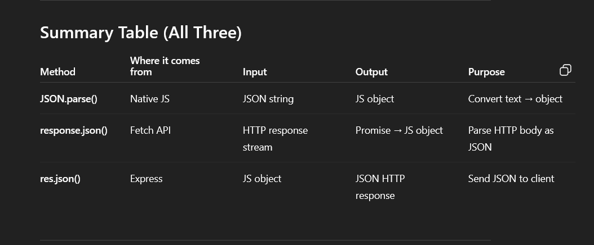

# JSON

Perfect, let’s dive into **JSON** from the ground up 🚀

---

# 🟢 What is JSON?

- **JSON** = **JavaScript Object Notation**
- A lightweight **text-based format** for storing and exchanging data.
- Based on JavaScript object syntax, but it’s language-agnostic — every modern language supports JSON (Python, Java, C#, Go, etc.).
- Commonly used in **APIs**, **config files**, and data exchange between server & client.

---

# 🟢 JSON Structure

- Data is written as **key–value pairs** inside `{ }`
- Keys are always **strings** wrapped in double quotes (`" "`)
- Values can be:
    - string (`"hello"`)
    - number (`42`)
    - boolean (`true` / `false`)
    - null
    - object (`{ ... }`)
    - array (`[ ... ]`)

✅ Example JSON:

```json
{
  "name": "Shahid",
  "age": 22,
  "isStudent": false,
  "skills": ["JavaScript", "React", "Node.js"],
  "address": {
    "city": "Delhi",
    "zip": "110001"
  }
}

```

---

# 🟢 JSON vs JavaScript Objects

- Very similar, but **not the same**:
    - JSON keys **must** use double quotes
    - JSON doesn’t allow `undefined`, functions, or comments
    - JSON is purely **data**, not behavior

✅ JavaScript object:

```jsx
const obj = { name: "Shahid", age: 22 };

```

✅ JSON string (notice quotes around keys):

```json
{ "name": "Shahid", "age": 22 }

```

---

# 🟢 JSON in JavaScript

JavaScript provides the **`JSON` object** with two core methods:

---

## 1. `JSON.stringify(value[, replacer, space])`

Converts a JavaScript object/array into a **JSON string**.

```jsx
const user = { name: "Shahid", age: 22, skills: ["JS", "React"] };

const json = JSON.stringify(user);
console.log(json);
// Output: {"name":"Shahid","age":22,"skills":["JS","React"]}

```

### Optional Parameters

- **replacer**: filter properties
    
    ```jsx
    JSON.stringify(user, ["name", "age"]);
    // {"name":"Shahid","age":22}
    
    ```
    
- **space**: pretty-print
    
    ```jsx
    JSON.stringify(user, null, 2);
    /*
    {
      "name": "Shahid",
      "age": 22,
      "skills": ["JS", "React"]
    }
    */
    
    ```
    

---

## 2. `JSON.parse(text[, reviver])`

Converts a JSON string back into a JavaScript object.

```jsx
const str = '{"name":"Shahid","age":22}';
const obj = JSON.parse(str);

console.log(obj.name); // Shahid
console.log(obj.age);  // 22

```

### Optional `reviver` function

Lets you transform values while parsing:

```jsx
const str = '{"birthYear":2000}';
const obj = JSON.parse(str, (key, value) => {
  if (key === "birthYear") return 2025 - value; // convert to age
  return value;
});
console.log(obj.birthYear); // 25

```

---

# 🟢 Common Use Cases

1. **APIs**
    
    ```jsx
    fetch("https://jsonplaceholder.typicode.com/posts/1")
      .then(res => res.json())     // parse JSON response
      .then(data => console.log(data));
    
    ```
    
2. **LocalStorage**
    
    ```jsx
    const user = { name: "Shahid", age: 22 };
    localStorage.setItem("user", JSON.stringify(user));
    
    const saved = JSON.parse(localStorage.getItem("user"));
    console.log(saved.name); // Shahid
    
    ```
    
3. **Config Files**
    - `package.json` in Node projects is literally a JSON file.

---

# 🟢 JSON Methods Recap

| Method | What it does | Example |
| --- | --- | --- |
| `JSON.stringify(obj)` | Convert object → JSON string | `JSON.stringify({a:1})` → `{"a":1}` |
| `JSON.stringify(obj, null, 2)` | Pretty-print with spaces | formatted output |
| `JSON.stringify(obj, ["prop1"])` | Only include certain keys |  |
| `JSON.parse(str)` | Convert JSON string → object | `JSON.parse('{"a":1}')` |
| `JSON.parse(str, reviver)` | Transform while parsing | Convert dates, etc. |

---

# 🟢 Gotchas / Pitfalls

- **Single vs double quotes**: JSON requires **double quotes** for keys & strings.
- **No comments allowed** in JSON.
- **Data types**: JSON doesn’t support `undefined`, `Infinity`, or functions.
- Use try/catch when parsing:
    
    ```jsx
    try {
      const data = JSON.parse('invalid json');
    } catch (err) {
      console.error("Parsing failed!", err);
    }
    
    ```
    

---

✅ In short: JSON is your universal **data serialization format**, and `JSON.stringify` / `JSON.parse` are the key methods to move between **JavaScript objects** and **JSON strings**.

---

Would you like me to also show you how **dates** and **circular objects** behave with `JSON.stringify` (since those often trip people up)?



Excellent question — and the answer is actually simple once you understand what **JSON really is**.

# 1. JSON is *not* a data type in JavaScript

JSON **is not an object**, **not a structure**, and **not something you manipulate directly**.

JSON is **just a text format** — like:

- XML
- CSV
- HTML

It is a *string representation* of data.

Because JSON is only **text**, there is nothing to “manipulate” in the sense of methods or functions.

You manipulate **JavaScript objects**, not JSON.

---

# 2. JSON is not stored in memory as a data structure

When you receive JSON from a server, you receive a **string**.

Example of JSON:

```json
{"name": "Alice", "age": 25}

```

But inside JavaScript memory, JSON does **not exist** unless you keep it as a string.

To work with it, you must convert it to a JavaScript object:

```jsx
const obj = JSON.parse('{"name":"Alice","age":25}');
obj.age = 30; // now you can manipulate it

```

JSON itself never held the data structure — the object does.

---

# 3. Manipulation happens *after* parsing

If you want to modify something, you modify the **object**, not the JSON string.

Example:

```jsx
let jsonString = '{"name":"Alice"}';

let obj = JSON.parse(jsonString); // convert to object
obj.name = "Bob";                 // manipulate object
jsonString = JSON.stringify(obj); // convert back to JSON

```

---

# 4. Why no “JSON methods”?

Because JSON is meant to be:

- Interchange format
- Language-neutral
- Minimal and universal

Functions like:

- `JSON.addKey()`
- `JSON.removeKey()`
- `JSON.updateValue()`

would make JSON a *programmable data structure*, which violates its purpose.

JSON must be:

- static
- minimal
- portable to any programming language

Every language has its *own* way to manipulate the data **after parsing**.

---

# 5. JSON in JavaScript is handled by the global JSON object

But its only job is **conversion**:

| Method | Purpose |
| --- | --- |
| `JSON.parse()` | JSON string → JS object |
| `JSON.stringify()` | JS object → JSON string |

No manipulation, because JSON is not a structure.

---

# 6. Analogy

Think of JSON as a **photo** of data.

You cannot edit the *photo* directly — you must load it into an editor (JS object), change it, and then export it again (stringify).

---

# Summary

Why there are no functions to manipulate JSON itself:

1. **JSON is just text**, not a data structure.
2. **You manipulate objects, not text formats.**
3. JSON must remain universal; manipulation depends on each language’s object model.
4. JavaScript only provides `parse` and `stringify` because JSON’s job is **serialization**, not manipulation.

---

If you’d like, I can show you:

- a visualization of JSON flow between client/server
- how JSON compares to XML or YAML
- how a custom JSON-manipulation library could theoretically work