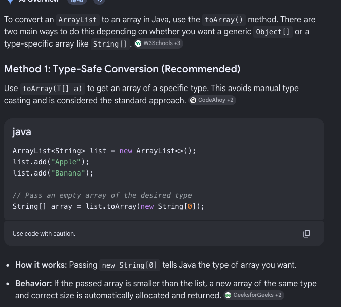

# Java Collections Framework

# Limitations of Arrays

- Can only store homogeneous data (same type).
- Although this problem can be fixed using object arrays, there are better alternatives.

```java
Object obj[] = new Object[10];     // An object array created, which can store 
																				// values of any data type
```

- Arrays are fixed in size (n0t growable in nature).
- Arrays don’t use any underlying data structure. (no predefined methods).

# Collection Framework

- Java has provided some classes and interfaces within the collection framework to deal with the above mentioned issues.
- The collection framework consists of:
    - ArrayList
    - List
    - HashMap
    - HashTable
    - Tree Stack
    - Set
    - HashSet

# Advantages of The Collection Framework

- Growable in nature.
- Can store both homogenous and heterogenous data.
- Implemented using underlying data structures (so readymade functions are available).

# Interfaces in The Collection Framework

- **Collection(I):** Root interface, which contains common methods which can be used for other collection objects.
- 

# ArrayList

- list with a mutable size.

```java
//Declaration of an ArrayList:

	List<String> studentName =  new ArrayList<>(); 
```

- We can add elements at the end of the ArrayList.

```java
studentName.add("Suresh");
```

- To insert an element at an index:

```java
studentName.add(1, "Vaigesh");
```

- Adding a new list to an existing list:

```java
List<Integer> newList = new ArrrayList<>();
newList.add(5);
newList.add(6);

existingList.addAll(newList); //adding all elements of the new list into the 
																	//original list.
```

- Getting the value stored at any index of the Array List:

```java
System.out.println(newList.get(1));
```

- To remove an element at a given index:

```java
studentName.remove(2); //removes element at index 2
```

- To remove the specified element:

```java
newList.remove(Integer.valueOf(5)); //removes 5 from the list
```

- To clear the whole list:

```java
studentName.clear();
```

- For updating a value at an index:

```java
studentName.set(2, "Danish");
```

- To check if an element is present in the list:

```java
System.out.println(studentName.contains("Danish"));
```

- For finding the length or size of the list, we use:

```java
System.out.println(studentName.size());
```

- For iterating over the loop:
    - For Loop:
    
    ```java
    for(int i = 0; i < newList.size(); i++){
    	System.out.println(newList.get(i));
    }
    ```
    
    - For-Each Loop:
    
    ```java
    for (Integer el:list){
    	System.out.println(el);
    }
    ```
    
    - Iterator: built-in iterator for the framework
    
    ```java
    Iterator<Integer> it = newList.iterator();
    
    while(it.hasNext()){
    	System.out.println(it.next());
    }
    ```
    

# Stack

- List which follows the principle of LIFO (Last-In First-Out)

```java
Stack<String> sc = new Stack<>(); 
```

- To insert elements:

```java
sc.push("Lion");
```

- To get the value of the last pushed element:

```java
sc.peek();
```

- To remove an item from the top of the stack.

```java
sc.pop();
```

# **Linked List**

- A data structure where every element is linked to the previous element.

```java
List <Integer> li = new LinkedList<>();
```

- All other functions will be exactly the same as ArrayList as both of them are implemented from the List interface.

# **Queue**

- Follows the principle of FIFO (First In First Out).

```java
Queue <Integer> queue = new LinkedList<>();
```

- To enter elements:

```java
queue.offer(20);
```

- To remove and get the first inserted element:

```java
int a = queue.poll();
```

- To know the next element to be removed:

```java
int b = queue.peek();
```

- Handy declaration in BFS for binary trees:

```java
        Queue <TreeNode> q = new LinkedList<>(List.of(root));
```

- To check if the queue is empty:

```java
System.out.println(q.isEmpty());
```

# HashSet

- No duplicate elements are allowed.

```java
Set <Integer> set = new HashSet<>();
```

- To add an element:

```java
set.add(33);
```

- Order of elements is not maintained.
- To remove an element:

```java
set.remove(33);
```

- To check if an element is present in the set:

```java
System.out.println(set.contains(33));
```

- To check if the set is empty:

```java
System.out.println(set.isEmpty());
```

- For the set size:

```java
System.out.println(set.size());
```

- To clear the set:

```java
set.clear();
```

# HashMap

- Has key-value pairs.

```jsx
Map <String, Integer> map = new HashMap<>();
```

- To insert a pair:

```java
map.put("One", 1);
```

- To update the value of a key re-insert it.

```java
map.put("One", 2);
```

- To avoid rewriting:

```java
map.putIfAbsent("One", 3);
```

- To check if it contains a key:

```java
System.out.println(map.containsKey("One"));
```

- To check if it contains a value:

```java
System.out.println(map.containsValue(2));
```

- To check if the map is empty:

```java
System.out.println(map.isEmpty());
```

- To clear the map:

```java
map.clear();
```

- To iterate over the hashmap:

```jsx
for( Map.Entry<Character, Integer> entry : map.entrySet()){
	System.out.println(entry.getKey());
	System.out.println(entry.getValue());
}
```

- To only iterate over the keys:

```jsx
for(char key: map.keySet()){
	System.out.println(key);
}
```

- To only iterate over the values:

```jsx
for(int value: map.values()){
	System.out.println (value);
}
```

# Priority Queue

- used to implement heaps.

```java
PriorityQueue<Integer> pq = new PriorityQueue<>();
```

- to add

```java
pq.offer(15);
pq.offer(13);
```

- By default it implements a min-heap.
- to remove the smallest element. The queue heapifies automatically.

```java
	System.out.println(pq.poll());
```

- to get the value of the smallest element.

```java
System.out.println(pq.peek());
```

- to implement a max-heap:

```java
	PriorityQueue<Integer> pq = new PriorityQueue<>(Comparator.reverseOrder());
```

```jsx
for( Map.Entry<Integer, Integer> entry: m.entrySet()){
	sopln(entry.getKey());
	sopln(entry.getValue());
}

for(Map.Entry<Character, Integer> entry: map.entrySet()){
	sopln(entry.getKey())
	sopln(entry.getValue())
```

