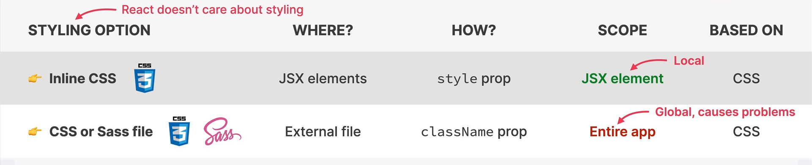

# React.js Notezz⚔️

<aside>
💡

This is PDF 1 of the 2 React pdfs. This doesn’t include Redux, Next.js and some additional concepts.

</aside>

# Why do front-end frameworks exist??

- because keeping a user interface in-sync with data is hard.
- to enforce a correct way of writing and structuring code.
- to give developers a consistent way of building front-end applications.

# What is React??✨

- React is a JS library for building user interfaces.
- Components are building blocks of React.
- We reuse components.
- To describe what each react component will look like, (based on the current state of data) we use a special declarative syntax called JSX.
- React allows you to stay away from the DOM by removing the need to access different elements repeatedly.
- JSX allows to group HTML, CSS and JS syntax and it also references to other react components.
- The ever changing data is called ‘state’ and react keeps updating the UI with every change in the current state.
- React **‘reacts’** to state changes by re-rendering the UI.

# Components

- React applications are entirely made out of components.
- They are the building blocks of user interfaces in React.
- A component has its own data, logic and appearance.
- Components can be reused, nested inside each other, and they can pass data between them.

```jsx
function App() {
  return (
    <div>
      <h1> Hello React! </h1>
      <Pizza />
      <Pizza />
      <Pizza />
    </div>
  );
}

function Pizza() {
  return (
    <>
      
      <h2>Pizza Spinaci</h2>
      <p>Tomato, mozarella, spinach, and ricotta cheese</p>
    </>
  );
}
```

- The code includes three instances of the above defined Pizza() component in the main App() component, demonstrating usability.
- A component can only return a single JSX element at a time, so multiple JSX elements must be wrapped inside a single empty element like **<></> or <div></div>.**

# JSX

- Declarative syntax to describe what components look like and how they work.
- Components must return a block of JSX.
- It allows us to embed JS, CSS and React Components into HTML.
- React enables us to throw away the imperative approach in building applications.
- Imperative approach stands for accessing DOM elements and manipulating them one by one through event handlers in the vanilla JS.
- This approach is painstakingly slow and messy.
- Declarative approach just describes what the UI should look like at all times, based on the current data.
- We never touch the DOM(Document Object Model) directly.

# Styles in JSX

- React does not have an opinion on how components should be styled.
- Components can be styled using inline CSS, importing a global CSS file or having styled components.

- Using JSX:
    
    We enclose CSS properties in an object.
    
    - **style={{color : col}}** assigns an object to the style component.

```jsx
function Header() {
  const col = "";
  return (
    <header>
      <h1 style={{ color: col }}>Fast React Pizza Co.</h1>;
    </header>
  );
}
```

- Using Global CSS imports:
    
    ```jsx
    import "./index.css";
    function Header() {
      return (
        <header className="header">
          <h1>Fast React Pizza Co.</h1>;
        </header>
      );
    }
    ```
    
    - **‘className’** property is used instead of **‘class’** in JSX.

# Props

- Props act as communication channels between parent and child components.
- They are used to transfer data to the child components.
- Props are read-only. Which means Props can only be modified by the parent component.
- Props and States can be used to manipulate data in a component.
- While States (internal data updated by component logic) are defined for the component itself, Props are passed down from Parent elements.
- If you ever feel like you need to change a prop value in the component itself, what you really need is state.
- Let’s make it a rule to not mutate any foreign or global data in a function component.

```jsx
function Menu() {
  return (
    <main className="menu">
      <Pizza
        name="Pizza Margherita"
        ingredients="Tomato and mozarella"
        imgsrc="pizzas/margherita.jpg"
        altext={pizzaData[0].name}
        price={10} // we can pass numbers using JS mode{}
      />
      </main>
  );
}

function Pizza(props) {  // props passed as an object
  return (
    <div className="pizza">
      
      <div>
        <h3>{props.name}</h3>
        <p>{props.ingredients}</p>
        <span>{props.price}</span>
      </div>
    </div>
  );
}
```

# Rules of JSX

- In JSX, we can enter the JS mode by using curly braces **‘{}’**(expressions).
- JavaScript expressions like arrays, maps, reference variables, ternary operators, objects etc; can be used inside JavaScript Mode.
- Statements like if-else, switch statement, for loops etc; cannot be used inside the JavaScript mode, as they don’t return a value.
- You can write JSX anywhere inside a component.
- JSX has one root element. You can use **<React.Fragment> (or the short <></>)** to bypass this.
- Comments need to be in **‘{}’** (because they are a part of JS).

# Rendering Lists

- In JSX manually passing props for each element of a large array data can be tedious. Instead, we can use array functions like .map() to return a new array of components with the respective data from the original data array.

```jsx
//considering we have an array pizzaData[] consisting objects 
//which have description of each pizza item.

function Menu() {
  return (
    <main className="menu">
      <h2>Our Menu</h2>
      <ul className="pizzas">
        {pizzaData.map((i) => (
          <Pizza pizzaObj={i} key={i.name} />
        ))}
      </ul>
    </main>
  );
}

//This function has a map method which returns an array of <Pizza /> elements 
//for each item.
//The key prop is passed for react to differenciate between different Pizza elements.
//The key can be anything which is unique for each element (here name).

function Pizza(props) {
  return (
    <li className="pizza">
      
      <div>
        <h3>{props.pizzaObj.name}</h3>
        <p>{props.pizzaObj.ingredients}</p>
        <span>{props.pizzaObj.price}</span>
      </div>
    </li>
  );
}
```

# Conditional Rendering

- You can use logical expressions to determine the rendering of components.
- This can be achieved by **‘&&’ or ternary** operators.
- By **‘&&’ operator:**
    
    ```jsx
    function App() {
      const isData = pizzaData.length > 0;
      return (
        <div className="container">
          <Header />
          <CatchLine />
          {isData && <Menu />}
          <Footer />
        </div>
      );
    }
    ```
    
    - ‘isData’ stores a Boolean value (false/true) depending on the length of the array being zero or greater than zero, respectively.
    - In the above example, the Menu component is only shown when ‘isData’ is true.
    - When it’s false, **‘false’** is logged into the DOM but as Boolean values are not parsed to the window, nothing is displayed.
    - This method is called **‘short-circuiting’.**
    
- By **‘?:’(ternary operator):**
    - The above task can be done similarly, using the ternary operator.
    
    ```jsx
    function App() {
      const isData = pizzaData.length > 0;
      return (
        <div className="container">
          <Header />
          <CatchLine />
          {isData ? (
            <Menu />
          ) : (
            <p>We are still working on the menu. Please come back later.</p>
          )}
          <Footer />
        </div>
      );
    }
    ```
    
    - The advantage being, you can add else expressions in it after the **‘:’.**

# Conditional Rendering With Multiple Returns

- Using if-else on components.

```jsx
function Pizza(props) {
  if (props.pizzaObj.soldOut === true) return null;
  return (
    <li className="pizza">
      
      <div>
        <h3>{props.pizzaObj.name}</h3>
        <p>{props.pizzaObj.ingredients}</p>
        <span>{props.pizzaObj.price}</span>
      </div>
    </li>
  );
}
```

- Here soldOut is true, so that particular Pizza component won’t be returned.

# Destructuring Props

- You can destructurize the passed props in the component argument itself.

```jsx
function Menu() {
  return (
    <main className="menu">
      <h2>Our Menu</h2>
      <ul className="pizzas">
        {pizzaData.map((i) => (
          <Pizza pizzaObj={i} key={i.name} />
        ))}
      </ul>
    </main>
  );
}

function Pizza({ pizzaObj }) {
  if (pizzaObj.soldOut === true) return null;
  return (
    <li className="pizza">
      
      <div>
        <h3>{pizzaObj.name}</h3>
        <p>{pizzaObj.ingredients}</p>
        <span>{pizzaObj.price}</span>
      </div>
    </li>
  );
}
```

- Here, the name of the variable should be same in both the call and component definitions.

# React Fragments

- Components must return a single root element. But sometimes, we want multiple elements to be returned without them being wrapped in a parent element like **<div></div>.**

```jsx
return(<div>
        <CatchLine />
        <ul className="pizzas">
          {pizzaData.map((i) => (
            <Pizza pizzaObj={i} key={i.name} />
          ))}
        </ul>
      </div>)
```

- To solve this issue, React fragments are introduced which enclose the components in a virtual container, without appearing in the DOM.
- The required JSX is enclosed within **<></>.**

```jsx
return(<>
        <CatchLine />
        <ul className="pizzas">
          {pizzaData.map((i) => (
            <Pizza pizzaObj={i} key={i.name} />
          ))}
        </ul>
      </>)
```

# Using Conditions on Classes and Text

### Conditional Text:

- Sometimes, you may have the surety for using a particular tag in your JSX, but you may not have the same confidence on the content inside. Conditional texts become handy in these situations.

```jsx
<span>{pizzaObj.soldOut ? "SOLD OUT" : pizzaObj.price}</span>
```

- In the above code, we have the surety of including a span element in our JSX, but we’re unsure of it’s text content.
- So we use a ternary operator to resolve this issue.
- If the soldOut value is false, the price is displayed, else an appropriate message denoting the item being ‘out of stock’ is displayed.

### Conditional Classes:

- Similar to the case of text, you may want to add classes to a tag only when a particular condition is met.
- In such situations Conditional classes are added.

```jsx
<li className={`pizza ${pizzaObj.soldOut ? "sold-out" : ""}`}>
```

- In the above exemplar code, class name of “sold-out” is added to li based on a condition.
- Backticks**(``)** are used for string interpolation with **‘$**’ inside JS mode.
- If the soldOut value is true, sold-out class is added, else nothing is added to the class list.

# Handling Events in React

- Events in react are handled using the **‘onClick’** attribute.

```jsx
<div onClick={function_name}>Hello React</div>
```

- The function can be defined elsewhere in the program.
- It is important to keep in mind to **not** call the function immediately.

```jsx
<div onClick={function_name()}>Hello React</div>   //This won't work as intended.
```

# State

- Data that a component can hold over time, necessary for information that it needs to remember throughout the app’s life cycle.
- It is a component’s memory.
- State variable / piece of state is a single variable in a component (component state).
- The term state refers to the entire state the component is in.
- Updating state variables triggers React to re-render the component.
- A single component when rendered is called a view.
- All the views combined together make up the final UI.
- All in all, state keeps the UI in sync with the data.
- A hook function (a function that starts with ‘use’) **‘useState()’** is used for implementing states.
- The useState function must be imported before using it.

```jsx
import {useState} from "react"
```

- useState() must be used at the beginning of a component and not in between.
- A useState call takes the initial value of the state as the parameter and returns an array with two elements, the state and the set state function.
- Both the elements are dereferenced at the place of the call.

```jsx
import {useState} from "react"
function App(){
	const [state, setState] = useState(0);
```

- Never change the state using vanilla JS expressions, always use the setState function, as the former will not not re-render the component on state change.
- The setState function uses a callback function to change the state.
- Not using a callback function may introduce bugs, as react may ignore subsequent setState functions adjacent to each other. Callback functions solve this issue.

```jsx

import {useState} from "react"
function Box() {
  const [c, setc] = useState(1); //state declaration
  function inc() {
    if (c < 3) {
      setc((s) => s + 1); //setc uses a call-back function. The alternative is "setc(c+1)", but it shouldn't be used.
    }
  }
  function dec() {
    if (c > 1) {
      setc((s) => s - 1);
    }
  }
  
  
  //JSX
  return (
    <div className="box">
      <StepBar steps={c} />
      <Steps num={c} />
      <div className="butt-div">
        <button className="butt" onClick={inc}>
          Next
        </button>
        <button className="butt" onClick={dec}>
          Previous
        </button>
      </div>
    </div>
  );
}

```

# One Component, One State

- Each component has and manages its own state, no matter how many such component instances are made.
- UI is a function of state.
- UI = f(state)

# Guidelines for State

- Use a state variable for any data that the component should keep track of (”remember”) over time. This is data that will change at some point. In vanilla JS, that’s a let variable, or an [] or {}.
- Whenever you want something in a component to be dynamic, create a piece of state related to that “thing”, and update the state when the thing should change (aka be “dynamic”).
- If you want to change how a component looks, or the data it displays, update its state. This usually happens in an event handler function.
- For data that should not trigger components re-renders, don’t use state. Use a regular variable instead. This is a common beginner mistake.

# Handling Submissions

- Submissions can be handled with the **‘onSubmit’** attribute in the **<form>** tag.
- A handler function is called to deal with the event.

```jsx
function Form() {
  function handleSubmit(e) {
    e.preventDefault();
  }
  return (
    <form className="add-form" onSubmit={handleSubmit}>
      <h3>What do you need for your 😍 trip?</h3>
      <input type="text" placeholder="Item..." />
      <button>ADD</button>
    </form>
  );
}
```

- The event object **‘e’** is used here to prevent the default reload of the page when the form is submitted.

# Controlled Elements

- When changes in an input field are need to be captured, we use a state variable to log the changes and update the input field with that change.
- Here the concept of controlled events comes into play.
- The value of the input field is updated using the state variable, and the state variable is changed using the setState function, which is triggered by an event occurrence.
- The event is captured in the event object and the change is reflected in the DOM.
- The onChange function is triggered when an event occurs, it passes an event object to a callback function, where the setState function accesses the **‘e.target.value’.**
- The new state is then set using the setState function.
- The value prop of the element is then updated with the current state.
- Thus, making the changes visible in the input field.

```jsx
<input
        type="text"
        placeholder="Item..."
        value={description}
        onChange={(e) => setDescription(e.target.value)}
      />
```

The **value in the `onChange` event** and the **value in the `value` prop** are not the same. Here's how they differ:

---

### 1. **`value` in the `onChange` Event**

- This is the value **entered by the user** in the input field at the time of the event.
- It is accessed through **`e.target.value`** (where **`e`** is the event object passed to the **`onChange`** handler).
- It represents the **current user input** at the time the event is triggered.

---

### 2. **`value` in the `value` Prop**

- This is the value **controlled by the React state** that determines what the input field displays.
- It is passed as a prop to the input element (`value={description}` in your example).
- It reflects the value of the state (e.g., `description`) at the time of rendering.
- React uses this to ensure the input's displayed value stays synchronized with the state.

---

### Key Difference

| **`value` in `onChange` (Event)** | **`value` Prop** |
| --- | --- |
| Comes from the user's interaction. | Comes from the React state or variable. |
| Accessed via **`e.target.value`**. | Set via the **`value`** prop in the JSX. |
| Represents the **current input** value. | Represents the **rendered value**. |
| Triggers state updates (via **`setState`**). | Reflects updated state after re-rendering. |

---

### Example Walkthrough

### Code:

```jsx
import { useState } from "react";

export default function App() {
  const [description, setDescription] = useState("");

  return (
    <div>
      <input
        type="text"
        value={description}
        onChange={(e) => {
          console.log("onChange value:", e.target.value);
          setDescription(e.target.value);
        }}
      />
      <p>Value prop: {description}</p>
    </div>
  );
}

```

---

### Behavior:

1. **Initial State**:
    - **`description`** = **`""`** (empty string).
    - The input field is empty because **`value={description}`**.
2. **User Types `H`**:
    - The **`onChange`** event fires, and **`e.target.value`** is **`"H"`**.
    - **`setDescription("H")`** updates the state.
    - React re-renders, setting **`value={description}`** to **`"H"`**.
    - The input field now displays **`"H"`**.
3. **User Types `e` (after `H`)**:
    - The **`onChange`** event fires again, and **`e.target.value`** is **`"He"`**.
    - **`setDescription("He")`** updates the state.
    - React re-renders, and the input now displays **`"He"`**.

---

### Key Insight

- **`onChange` (via `e.target.value`) captures the immediate user input.**
- **The `value` prop reflects the state of the input after React processes the change and re-renders the component.**

In controlled components, this interaction ensures synchronization between user input and React state.

# Props vs State

| **State** | **Props** |
| --- | --- |
| State is internal data, owned by the component | Props are external data, owned by the parent. |
| Component’s memory | Similar to function parameters. |
| Can be updated by the component itself. | Read only |
| Updating state variables causes the component to re-render. | **Receiving new props causes the component to re-render.** Usually when the parent’s state has been updated. |
| Used to make components interactive. | Used by parent components to configure child components. |

# Local State vs Global State

| **Local State** | **Global State** |
| --- | --- |
| State needed by one or few components. | State that many components might need. |
| Defined by a component and only that component and child components have access to it (via passing props). | Shared state that is accessible to every single component in the entire application. |

# Lifting State Up

- When change in state of one component needs to be reflected in a sibling component, the concept of ‘lifting state up’ is used.
- In this approach the original state is lifted up to the nearest common parent of the siblings.
- The set function is passed to the state determining child
- The state variable is passed to the other child, on which the change is to be reflected.

```jsx
export default function App() {
  const [items, setItems] = useState([]);
  function handleItems(newItem) {
    setItems((i) => [...i, newItem]);
  }
  return (
    <div className="app">
      <Logo />
      <Form handleItems={handleItems} />
      <PackingList items={items} />
      <Status />
    </div>
  );
```

- In the above example, **‘handleItems’** function handles the state change.
- But this function is not available in the **‘Form component’**, where the change should be triggered. So the function is passed as a prop to the **‘Form component’**.
- The **‘items’** object is passed as a prop to the **‘PackingList component’**, where the change is to be reflected.
- This method also introduces the concept of **‘inverse data flow’**, by using the passed prop function to set the state of the parent element.
- So this kind of contradicts the **‘one way flow’** approach of **React.**

# Derived State

- State that is computed from an existing piece of state or from props.
- Some ever-changing data which can be easily derived from an existing state variable, must not make a state of its own.
- Creating unnecessary and redundant state variables may cause sync issues between these states.
- Unnecessary states result in unnecessary re-renders.

# The ‘Children’ Prop

- The **‘Children Prop’** makes a component really reusable.
- One can pass custom content to a child component without the need of props.
- Any component in React can be written in this form **`<[Component_Name]>**[content]**</[Component_Name]>`.**
- The content is passed to the component in the form of a predefined prop called **‘children’.**
- This prop can then be accessed in the child component and used wherever necessary.
- This provides drastically more control over the child component and reduces the need of passing multiple props.

```jsx
function Box(){
		 return <Button textColor="white" bgColor="#7950f2" onClick={dec}>
					       <span>👈</span> Previous   
			       </Button>                 // This is the content being passed
}     

function Button({ textColor, bgColor, onClick, children }) { //child function
  return (
    <button
      className="butt"
      style={{ color: textColor, backgroundColor: bgColor }}
      onClick={onClick}
    >
      {children}       //using the predefined children prop
    </button>
  );
}
```

- In the above example, an emoji with a span element containing text is passed via the **‘children prop’.**
- The prop is then used as the content for the custom button element.

# When to use Components?

- A design where all the content is fit into a single component, making it extra large, is bad.
- In contrast, a design where every specific element on the page is wrapped into a unique components, may lead to unnecessary abstraction, and increase the complexity of the code.
- A balance between the two should be maintained while building the application.
- When in doubt, start with a relatively bigger component, then split that bigger component into smaller ones.
- Check if the component contains pieces of content or layout that do not belong together, whether you want or need to reuse it, or if it’s trying to do multiple things at once. If any of the three situations arise, consider splitting.
- Other likely situations of interest may be too many pieces of state and/or effects, and too large/complex JSX.
- If you just prefer smaller components, feel free to make those if it suits your coding style.
- Smaller components are generally more reusable, while the bigger ones are mostly the non-reusable ones.
- Never let a component call itself, no matter how deep the call is nested. Doing so will result in an infinite loop.

# Classification of Components

- Components can be classified into three categories:
    - **Stateless/Presentational Components:** Components which do not have their own state variables, and may or may not use passed down props. They are usually small components, and do a specific task. They are also mostly reusable components. (Ex: The Logo component)
    - **Stateful Components:** Components which do have their own state variables. They can be of various sizes, and may or may not be reusable. (Ex: The Search component)
    - **Structural Components:** Components which decide the overall structure of the webpage. They are usually large components, and are mostly non-reusable. (Ex: The Main component)

# Prop Drilling

- If you have a long nested chain of children for a component, it may be too tedious a job for you to pass a particular prop down the component tree. Multiple prop passings are required, which is highly inefficient.
- The components in the middle of the tree may not even require the passed prop, still it is to be unnecessarily traversed through.
- React has some workarounds for this situation.
- One of this is coming up next.

# Composition of Components

- The issue of **prop drilling** can be solved with composition of components.
- In this method the component is passed as a children prop to the child prop.
- This eliminates the need of passing the props through multiple levels altogether.

```jsx
<NavBar>
  <Search />
</NavBar>
```

- In this example the ‘Search component’ is passed as a children prop to the ‘NavBar component’.
- The passed component can be used in the following way.

```jsx
function NavBar({ children }) {
  return (
    <nav className="nav-bar">
      {children}   //here children prop has the 'Search component'
    </nav>
  );
}
```

- This technique very smartly solves the prop drilling issue in the following way:

```jsx
<NavBar>
  <Numresults>
    Found <strong>{movies.length}</strong> results
  </Numresults>
</NavBar>

function NavBar({ children }) {
  return (
    <nav className="nav-bar">
      {children}
    </nav>
  );
}

function Numresults({ children }) {
  return <p className="num-results">{children}</p>;
}
```

- Notice how in the above example no movies prop is passed through the components.
- Instead the ‘NumResults component’ itself is passed via the children prop, which is received by the ‘NavBar component’.
- The ‘NumResults component’ contains some content including ‘movies.length’. Since movies is available in the parent component, the need of passing the prop down the ladder is eradicated.
- All the content is put into place by the **‘children prop’.**
- The method of composition is also very handy in designing page structures, or layouts.
- We can also pass explicit component props instead of the children prop.

```jsx
<Box>
  <MovieList movies={movies} />
</Box>   // can be accessed only with the children prop

<Box element={<MovieList movies={movies} />}/>
   // can only be accessed by the custom element prop
```

- Here instead of using the children prop, the element is passed through a custom prop.
- The prop can be used in the child component in a similar fashion.

# Props as an API

- It is a good idea to implement a component, while keeping both the creator (you) and the user (may not be you) in mind.
- Props should be assigned to the component accordingly, maintaining a balance between customizability and rigidness.
- Too many props can make the user’s code too complex, and your code unusable.
- Too little of them can also lead to unusability, as your code is not customizable and may not suit their needs.
- In case you are using too many props, assign default values to them to minimize the user’s workload.

# Prop Types

- When you want to explicitly lock the data type of a prop, to prevent unwanted data types to be passed to them by other programmers, you can use the **PropType** Object.
- Before using, it must be imported first.

```jsx
import PropTypes from "prop-types";
```

- The component is selected and the types are specified in the form of an object.

```jsx
import PropTypes from "prop-types";

StarRating.propTypes = {
  maxRating: PropTypes.number.isRequired,
  color: PropTypes.string,
  size: PropTypes.number,
  className: PropTypes.string,
  messages: PropTypes.array,
  onSet: PropTypes.func,
};
```

- ‘is Required’ is added to specify that it is absolutely necessary to pass the prop when the component is called.
- Without it the component will throw an error.
- In all the cases, if the prop passed does not have the required type, the component will again throw an error.
    
    

 

# Component vs Instance vs Element

- A **Component** describes a piece of the interface.
- It’s a function in React that returns an element tree usually written as JSX.
- It’s a Blueprint or Template, that React uses to create one or more **Component Instances**.

```jsx
function Search(){
		return             //Component 
		//JSX code
}

function App(){         
		return <div>
				<Search/>       
				<Search/>      //Component Instances
				<Search/>
		</div>
}
```

- So actually it’s the component instances that make the UI, and not the component itself.
- Each of the component instances then return one or more 
**React Elements.**
- The **React Element** is an immutable object that contains all the information necessary to create DOM elements for the current component instance.
- So, the **DOM elements(HTML)** are the actual, final and visual representation of the component’s instance in the browser.
- It’s important to note that it’s not React Elements that are rendered in the DOM. They are just objects that reside in the React 
App.
- These are converted to DOM Elements which are basic HTML code.

# Instances and Elements in Practice

- You can call a component when required in a traditional JS way that is:

```jsx
{Search({id:223, color:'red'})};
```

- Although this call may look harmless, it does not create an instance of the component, so it doesn’t appear in the component tree.
- To avoid this issue, never call the elements by this syntax. Instead use the React way of handling them.

 

```jsx
<Search id=223, color="red"/>
```

# How Rendering works in React

- Any state changes in the application trigger the Render protocol.
- In the **Render Phase,** React calls the component functions and figures out how it should update the DOM.
- However it does not render the DOM in this phase.
- In React, rendering is **not** updating the DOM or displaying the elements on the screen.
- Rendering only happens internally inside React in the Render Phase, it does not produce visual changes.
- It’s the **Commit Phase,** in which React finally updates the DOM.
- Finally the browser repaints the screen, when it notices the change in the DOM.

# Render Trigger

- There are only two ways by which Render is triggered in React:
    - Initial render of the application.
    - State is updated in one or more components (re-render).
- The render process is triggered for the entire application.
- Renders are not triggered immediately after a state update happens, but are scheduled for when the JS engine has some “free time”. There is also batching of multiple setState calls in the event handlers.

# Render Phase

- All the component instances are called, after the initial Render Trigger.
- These calls will create React Elements, which altogether make up the virtual DOM.
- **Virtual DOM:** Tree of all React elements created from all instances in the component tree (after calling them).
- It’s relatively cheap and fast to create the virtual DOM because it’s just an object (other name: React Element Tree).
- Whenever there is a state update in a component Render is triggered, causing that component and its children (regardless of the props being passed) to be called and the resulting elements are used to create a new virtual DOM with the new elements (the component and its children) in their correct places.
- Rendering an element will cause all of it’s child elements to be rendered as well (no matter if the props change or not).
- It’s not the actual DOM, but the virtual DOM that is updated.
- The new virtual DOM will get reconciled with the current fiber tree (reconciler: **fiber**).
- The result of this reconciliation will be an updated fiber tree that will eventually be used to write to the DOM.
- Why not update the DOM directly at each state change?
    - because that would be inefficient and wasteful:
        - writing to the DOM is slow.
        - only a small portion of the DOM actually needs to be updated after a state change.
- **Reconciliation:** Reconciliation decides which DOM elements actually need to be inserted, deleted or updated, in order to reflect the latest state changes.
- So the reconciler is the engine of React. This reconciler never allows us to touch the DOM directly, instead it tells React what the next snapshot of the UI must look like.

# The Fiber Reconciler

- During the initial render of the application, fiber takes the entire React Element Tree and creates a fiber Tree based on the original.
- The difference being that it is created once and never destroyed unlike the React Element Tree which is re-created at each render.
- This internal tree has a fiber for each component instance and DOM element.
- Fibers are not created on every render.
- It is just mutated every time in future reconciliation steps.
- The elements in this tree are not arranged in a tree like fashion, instead they are implemented using the linked list data structure.
- Work can be done asynchronously.
- The reconciliation phase returns a **‘List of DOM Updates’ (Effects List)** that need to be carried out in the commit phase.

# Commit Phase

- React writes to the DOM in this phase.
- React goes through the **‘Effects List**’ created during rendering and applies them one by one to the already existing DOM tree.
- Writing to the DOM goes all in one go.
- So the committing phase is synchronous unlike the reconciler.
- This is to ensure that the browser never shows partial results, ensuring a constant UI.
- Finally the browser paints the UI on the screen.
- The library that executes the Commit phase and writes to the DOM is not **React** but **‘React DOM’.**
- React can work with other hosts. We can build mobile applications with **React Native.**
- We can make videos with React, using a package called **Remotion.**
- Similarly there are many such renderers of React for different use cases.

# Diffing

- Diffing uses two assumptions:
    - Two elements with different types will produce different trees.
    - Elements with a stable key stay the same across renders.
    - Diffing is comparing two elements step by step between two renders based on their position in the tree
- Two situations that matter in case of diffing are:
    - same position, different element:
        - React assumes entire sub-tree is no longer valid.
        - Old components are destroyed and removed from DOM, including state.
        - Tree might be rebuilt if children stayed the same (state is reset).
    - same position, same element:
        - Element will be kept (as well as the child elements), including state.
        - New props/attributes are passed if they changed between renders.
        - Sometimes we do not want this behavior. In that case we can use the **key prop.**

# The Key Prop

- Special prop to tell the diffing algorithm that a certain element is unique.
- Allows React to distinguish between multiple instances of the same component type.
- When a key stays the same across renders, the element will be kept in the DOM (even if the position in the tree changes).
- When a key changes between renders, the element will be destroyed and a new one will be created (even if the position in the tree is the same as before).
- Same element with changed positions and no key will result in a complete destruction of the element and will cause its re-creation (destroying its state too).
- To avoid this situation use key props.
- This will preserve the element when a new render occurs.
- **Similarly, when the same element appears in the same position in the tree, the state is preserved even if the props change.**
- This behavior can again be disabled by assigning props, which reset the state of the element when the key passed changes.
- This happens because with the key prop defined, react sees each element as a new component instance, which in the initial case was not true.
- Without the props defined, react treats those elements as one instance of the component, so it doesn’t reset their state on re-render.

# Rules for Render Logic

- **Render Logic:** All the logic that lives at the top level of the component function. It participates in how the component view looks like. Executed as soon as the code.
- **Event Handler Functions:** Executed as a consequence of the event that the handler is listening for. They actually perform operations: state updation, performing HTTP requests, reading or writing input fields, navigating to other page, etc.
- **Side Effects:** dependency on or modification of any data outside the function scope. “Interaction with the outside world”. Examples: mutating external variables, HTTP requests, writing to the DOM.
- **Pure Functions:** A function that has no side effects, meaning, it doesn’t change any variables outside its scope. A pure function returns the same output for a given unique input.
- **Side Effects are not Bad!** A program can only be useful if it has some interaction with the outside world.
- So there’s just one major rule to keep in mind.
- **Components must be pure when it comes to render logic:** Given the same props (input), a component instance should always return the same JSX (output).
- Render Logic shouldn’t produce any side effects, meaning no interaction with the outside world is allowed.
- So in render logic:
    - Do NOT perform network requests (API calls).
    - Do NOT start timers.
    - Do NOT directly use the DOM API.
    - Do NOT mutate objects or variables outside the function scope.
    - Do NOT update state (or refs) in render logic: This will create an infinite loop.
    - Side Effects are allowed (and encouraged) in event handler functions. There is also a special hook to register side effects (useEffect).

# State Update Batching

- React batches multiple setState functions into one in an event handler function.
- This batching results in increase in performance by avoiding the render of unwanted intermediate state updates.
- Only the final render is committed and viewed on the screen.

```jsx
function handleReset(e){
		setAnswer('');
		console.log(answer);
		setBest(true);
		setSolved(false);
};
```

- The following three state updates are batched into one and are rendered at once.
- The ‘console.log()’ will print the previous state and not the updated state here.
- That’s because state updates are asynchronous and React goes through all the statements before batching and updating the states altogether.
- So the print statement prints the old state value, which is also called a **‘stale state’**.
- This also applies when only one state variable is updated.
- Sometimes, we need the new value immediately after updating it.
- If we need to update state based on previous update, we use setState with callback **`(setAnswer(answer⇒…))`**
- In very rare scenarios, if we want to omit a problematic state update statement from batching, we can wrap it in a **`ReactDOM.flushSync()`** (but you will never need this).
- A safe rule of thumb is to always update states that depend upon the previous state with callback functions.

```jsx
function changeValue(){
		setValue(v=>v+3);
}
```

# How Events Work in React

- **Synthetic Events:** Event objects are not the same in React as vanilla JS. They fix certain inconsistencies, so that events work in the exact same way in all browsers. Most synthetic events bubble (including focus, blur, and change), except for scroll.
- Event handler keywords are written differently in:
    - **React:** using camelCase like **onClick, onChange** etc.
    - **Vanilla JS:** without “on” like **click** etc.
    - **HTML:** using lowercase letters like **onclick, onchange** etc.
- Default behavior can not be prevented by returning false from an event handler function in React as opposed to vanilla JS (**preventDefault()** function must be used to disable the default behaviors).
- Attach “Capture” if you want to handle during capture phase (example: **onClickCapture**).

# Library vs Framework

| **Framework** | **Library** |
| --- | --- |
| Everything you need to build a complete application is included in the framework. | You need to choose multiple 3rd-party libraries to build a complete application. |
| You’re stuck with the framework’s tools and conventions. | You need to research, download, learn and stay up-to-date with multiple external libraries. |
| Example: Angular | Example: React |

# React 3rd-Party Library Ecosystem

*** Underlined one’s are some important libraries.*

| **Function** | **Library** |
| --- | --- |
| **Routing (for SPAs)** | React Router, React Location |
| **HTTP requests** | JS Fetch(), AXIOS |
| **Remote State Management** | React Query, SWR, APOLLO |
| **Global State Management** | Context API, Redux, Zustand |
| **Styling** | CSS Modules, styled components, tailwindcss |
| **Form management** | React Hook Form, Formik |
| **Animations/transitions** | Motion, React-spring |
| **UI components** | Chakra, Mantine |
- **Next JS** and **Remix** are Opiniated React Frameworks that extend upon React to implement these functionalities under a single hood.

# Component Life Cycle

- **Mount:** Initial Render, Component instance is created for the first time. Fresh state and props are created.
- **Re-render:**
    
    Happens when: 
    
    - State changes
    - Props change (state is preserved, if type and key are the same)
    - Parent re-renders (state is preserved, if type and key are the same)
    - Context changes (state is preserved, if type and key are the same)
- **Unmount:** Component instance is destroyed or removed. State and props are also destroyed.

# How not to Fetch Data

- You should never fetch data in the following way:

```jsx
const key='75f9a3bb'
export default function App(){
	const [movies, setMovies] = useState([]);
	fetch(`http://www.omdbapi.com/?i=tt3896198&apikey=${KEY}&s=interstellar`)
	    .then((res) => res.json())
	    .then((data) => setMovies(data.Search));
	return <div>...</div>
}
```

- The following code will result in an infinite loop and won’t stop requesting the API.
- This happens because the setMovies function keeps re-rendering the component again.

# Effects

- **When to create Side Effects?**
    
    
    | **Triggered by Events** | **Triggered by Rendering** |
    | --- | --- |
    | Event Handlers | Effects (useEffect) |
- Effect allows us to write code that will run at different moments: mount, re-render, or unmount.
- **When to use useEffect vs Event handlers?**

| Event handlers | Effects (useEffect) |
| --- | --- |
| Executed when an event happens like a mouse click. | Executed after the component mounts (initial render), and after subsequent re=renders (according to the dependency array). |
- **Using Event Handler:**

```jsx
function handleClick(){
	fetch(`link`).then(res=>res.json()).then(data=>setMovies(data.Search));
	}
```

- **Using useEffect:**

```jsx
useEffect(function(){
	fetch(`link`).then(res=>res.json()).then(data=>setMovies(data.Search));
	},[])
```

- useEffect has three parts:
    - Effect code
    - Dependency array
    - return cleanup function (optional)
- It is used to keep a component synchronized with some external system (in this example, with the API movie data).

# The useEffect Dependency Array

- By default an effect will run after each and every render. We can prevent that by passing a dependency array.
- Without this array, React doesn’t know when to run the effect.
- Each time one of the dependencies changes, the effect will be executed again.
- Every state variable and prop used inside the effect MUST be included  in the dependency array.
- useEffect acts as an event listener that is listening for one of its dependencies to change. If the dependency changes useEffect will run again.
- If dependencies (states or props) change, the component is re-rendered. If these dependencies are stated in the dependency array, the useEffect will also execute every-time the component re-renders.

| **Form** | **Synchronization** | **Lifecycle** |
| --- | --- | --- |
| useEffect(fn, [x,y,z]) | Effect synchronizes with x, y and z. | Runs on mount and re-renders triggered by updating x, y or z. |
| useEffect(fn, []) | Effect synchronizes with no state/props. | Runs only on mount (initial render). |
| useEffect(fn) | Effect synchronizes with everything. | Runs on every render (usually bad). |

# When are Effects Executed?

- Render logic runs first, the effects are executed after the UI is painted on the screen.

```jsx
useEffect(function(){
		console.log("After initial render");
		}, []);
		
useEffect(function(){
		console.log("After every render");
		});     //no dependency array

console.log("During render");

```

- The console statement will run first followed by the two effects in the order they appear in the code.
- The first effect will only run on mount, while the second one will run on every render.

# Cleanup Function

- It is a function that we can return from an effect (optional).
- It runs on two occasions:
    - Before the effect is executed again.
    - After the component has unmounted.
    - We require cleanup functions whenever the side effect keeps happening after the component has been re-rendered or unmounted.
- Each effect should do only one thing.

```jsx
useEffect(function(){
		console.log("After initial render");
		return function(){     //cleanup function
				console.log("cleanup");
		}
		}, []);
```

- When multiple fetches are executed by an effect in close successions, it may so happen that the previous fetch takes a time longer than the   latest one. This may cause the wrong fetch result to be used. This situation is called the **Race Condition,** which can be fixed with cleanup functions.

# Hooks

- Special built in functions that allow us to “hook” into React internals:
    - Creating and accessing state from Fiber tree.
    - Registering side effects in Fiber tree.
    - Manual DOM manipulations.
- They always start with “use” (**useState, useEffect,** etc:)
- Enable easy reusing of non-visual logic: we can compose multiple hooks into our own custom hooks.

# Rules of Hook

- Hooks can only be called at the top level.
- Do not call hooks inside conditionals, loops, nested functions, or after an early return.
- This is necessary to ensure that hooks are always called in the same order (hooks rely on this).
- Hooks can only be called from React function components or custom hooks.

# More Details on useState

- The initial value provided to a useState hook only gets assigned at the first render or component mount and that initial value remains same for the entire component lifecycle.

```jsx
const a = 3;
const [state,setState] = useState(a>8);  // this state will have an initial value 
																							// of false for the entirety and will only 
																							// change with the setState function.
```

- State updation is asynchronous.
- Multiple state updation statements are batched together.

# Using Callbacks to initialize state

- Whenever the initial value of a state variable depends on some computation, we should use a pure function to initialize the state.

```jsx
const [state, setState] = useState( function(){ return ...} )
```

- The given function only runs once during initialization.
- The function used should be pure with no arguments.
- There must be a return statement to initialize the value.
- This method is also called **‘Lazy Evaluation’.**

# useRef

- It is a box model with a mutable **.current** property that is persisted across renders (”normal” variables are always reset).
- Two big cases:
    - Creating a variable that stays the same between renders (e.g. previous state, setTimeout id, etc:).
    - Selecting and storing DOM elements.
- Just like state, you are not allowed to read or write refs (.current) in render logic.

# State vs Refs

- Common stuff:
    - Both are persistent across renders.
- Difference:
    - Updating state will cause component re-render, which is not the case with refs.
    - Refs are mutable, but states are not.
    - Updates are asynchronous in states, but synchronous in refs.

# Refs to Select DOM elements

- Creating refs:

```jsx
import {useRef} from "react"
const inputEl = useRef(null)
```

- When selecting DOM elements the initial value is usually null.
- Use the ref prop to connect the DOM element to the Ref variable.

```jsx
import {useRef} from "react"

function Search({ query, setQuery }) {
  const inputEl = useRef(null);

  return (
    <input
      className="search"
      type="text"
      placeholder="Search movies..."
      value={query}
      onChange={(e) => setQuery(e.target.value)}
      ref={inputEl}    //ref prop  
    />
  );
}
```

- Use the useEffect hook to do DOM manipulations.

```jsx
import {useRef} from "react"

function Search({ query, setQuery }) {
  const inputEl = useRef(null);

	useEffect(function () {      // useEffect hook for DOM manipulations
    inputEl.current.focus();   // focus is just a DOM manipulation function
  }, []);
	
  return (
    <input
      className="search"
      type="text"
      placeholder="Search movies..."
      value={query}
      onChange={(e) => setQuery(e.target.value)}
      ref={inputEl}    //ref prop  
    />
  );
}
```

- When you want to update a value, on every render but at the same time  want to avoid re-renders due to this updation, **useRef** becomes handy.

# Custom Hooks

- Custom Hooks allow us to reuse stateful logic among multiple components.
- In other words non-visual logic which do not show up in the UI, but have hook definitions within them.
- One custom hook should have one purpose, to make it reusable and portable.
- Rules of hooks apply to custom hooks as well.
- Custom hooks need to use one or more React hooks.
- They are regular JS functions that can accept and return any data.
- The function name needs to start with the letter use.

# useReducer

- It enables a more advanced way of handling state.
- The reducer hook works with a reducer function that takes the previous state and a dispatch argument as arguments and will return the next state.
- The dispatch argument is also called the **‘action’** argument.
- The next state is returned based on the current state.

```jsx
function reducer(state, action) {
  if (action.type === "dec" || action.type === "inc")
    return state + action.payload;
  else return action.payload;
}

const inc = function () {
    // setCount((count) => count + step);  --older way
    dispatch({ type: "inc", payload: step });
  };
```

- The dispatch keyword is used instead of the setState function.
- An object with the type and payload is passed in the dispatch to perform actions accordingly in the reducer function.
- We can also use an object to store the initial state, which can be store multiple individual states in it.

```jsx
const initialState = { count: 0, step: 1 };

function reducer(state, action) {
  switch (action.type) {
    case "dec":
    case "inc":
      return { ...state, count: state.count + action.payload };
    case "defCount":
      return { ...state, count: action.payload };
    case "defStep":
      return { ...state, step: action.payload };
    case "reset":
      return initialState;
    default:
      return null;
  }
}

function DateCounter() {
  const [state, dispatch] = useReducer(reducer, initialState);
  const { count, step } = state;
  .
  .
  .
```

- The individual states can be accessed through one state object.

# Why useReducer?

- State management with useState is not enough in certain situations:
    - When components have a lot of state variables and state updates, spread across many event handlers all over the component.
    - When multiple state updates need to happen at the same time (as a reaction to the same event, like “starting a game”).
    - When updating one piece of state depends on one or multiple other pieces of state.
    - useReducer needs reducer function containing all logic to update state. Decouples state logic from component.
    - Reducer function has no side effects, so it is a pure function.
- Action is an object that describes how state must be updated.
- The dispatch function triggers a state update.

# Loading data from a fake API

- You can use a npm package to generate a fake API.

# useState vs useReducer

| **useState** | **useReducer** |
| --- | --- |
| useful for single pieces of states that are independent of each other. | ideal for related pieces of state and complex state. |
| Logic to update state is directly inside event handlers or effects, spread all over one or multiple components. | Logic to update state lives in one central place, decoupled from components: the reducer. |
| State is updated by calling setState (setter returned from useState) | State is updated by dispatching an action to a reducer. |
| Imperative state updates. | Declarative state updates: complex state transitions are mapped to actions. |
| Easy to understand and to use | More difficult to understand and implement. |

# When to use useReducer?

- Multiple piece of state     (Y) ———>
- Do states frequently update (Y) ———>    
together                                **useReducer()**
- Can you take the time       (Y) ———> 
to write a little more complex code
    
        (N)        (N)        (N)
    
         |          |          |
    
         |          |          |
    
         |          |          |
    
         V          V          V
    

               **useState()**

# **Using Vite**

- From now on we will be using Vite for developing our projects.
- Vite has ‘main.jsx’ as the entry point as compared to React App which has ‘index.js’ as the entry point.
- You need to manually install npm packages and **ESLint.**

# Routing

- With routing, we match different URLs to different UI views (React Components): routes.
- This is client-side routing which is different from server-side routing.

# Single-Page Applications

- Application that is executed entirely on the client (browsers).
- Routes: different URLs correspond to different views (components).
- JavaScript (React) is used to update the (DOM).
- The page is never reloaded.
- Feels like a native app.
- Additional data might be loaded from a web API.

# Routing with <Link/>

- This is an example showing how routing works in React Router

```jsx
import { BrowserRouter, Routes, Route } from "react-router-dom";
import Product from "./pages/Product";
import Pricing from "./pages/Pricing";
import HomePage from "./pages/HomePage";
import PageNotFound from "./pages/PageNotFound";
function App() {
  return (
    <div>
      <BrowserRouter>
        <Routes>
          <Route path="/" element={<HomePage />} />
          <Route path="product" element={<Product />} />
          <Route path="pricing" element={<Pricing />} />
          <Route path="*" element={<PageNotFound />} />
        </Routes>
      </BrowserRouter>
    </div>
  );
}

export default App;
```

- The `<Route/>` tag is used to assign path to components, which act as pages.
- We use the `<Link/>` tag to route a link to a particular page.
- Here, we are creating a Nav component using **React Router.**

```jsx
import { Link } from "react-router-dom";
function PageNav() {
  return (
    <nav>
      <ul>
        <li>
          <Link to="/">HomePage</Link>
        </li>
        <li>
          <Link to="pricing">Pricing</Link>
        </li>
        <li>
          <Link to="product">Product</Link>
        </li>
      </ul>
    </nav>
  );
}

export default PageNav;
```

- If we use `<NavLink/>` tag instead, the current page link gets an active class, that we can use to apply styles accordingly.

```jsx
import { NavLink } from "react-router-dom";
function PageNav() {
  return (
    <nav>
      <ul>
        <li>
          <NavLink to="/">HomePage</NavLink>
        </li>
        <li>
          <NavLink to="pricing">Pricing</NavLink>
        </li>
        <li>
          <NavLink to="product">Product</NavLink>
        </li>
      </ul>
    </nav>
  );
}

export default PageNav;
```

- This is the anchor tag element that gets the ‘active’ class.


# Styling Options in React

- React really doesn’t care about styling, so it also doesn’t care about which method you use for styling the webpages.
- We have been using two methods for applying CSS stylings:



- In professional apps CSS is almost never global. It causes inconsistencies in the project with change in one class resulting in undesired changes in undesired elements.
- CSS modules are used to fix this issue.
- Each component has its own style and that particular file is scoped to that particular component.
- This makes the components way more modular and usable.

# Using CSS Modules

- Create a file with the component name and extension `.module.css` .
- The file can contain styles implemented with classes but it doesn’t support styling of tags directly, like styling of div, ul, li elements directly is not supported.
- If we directly select elements and apply styles through their tags, this will cause changes to reflect in all occurrences of that particular tag, defeating the purpose of modular CSS altogether.
- The file is imported in the JSX file in the form of an object which can be used to access all the classes.

```jsx
import styles from "./PageNav.module.css";
```

- All the module classes get renamed by the browser with an id concatenated to them at the very end.
- This makes these class names unique, so you can use classes with same names in different modules.
- The styles object is then used to add class names to elements.

```jsx
    <nav className={styles.nav}>
```

- If we want a class name in a module to be global, we must declare it with the global keyword.

```jsx
:global(.test){
		background-color: red;
}
```

# Nested Routes and Index Routes

- When you want a certain section of the UI to change with the URL, you   use nested routes.
- It can be implemented in the following pattern:

```jsx
<Route path="/app" element={<AppLayout />}>
            <Route path="/cities" element={<p>Cities list</p>} />
            <Route path="/countries" element={<p>Country list</p>} />    //children routes
            <Route path="/form " element={<p>Form</p>} />
</Route>
```

- They can be accessed with the parent path as `/app/countries` etc:
- The required element is showed in the UI using an `<Outlet/>` tag.

```jsx
function SideBar() {
  return (
    <div className={styles.sidebar}>
      <Logo />
      <AppNav />
      <Outlet /> // The required elements will be displayed here. 
      <Footer />
    </div>
  );
}
```

- An Index Route is the default child route that is matched if no other specified child routes matches.
- That is the default child route for `/app`.

```jsx
<Route index element={<p>Cities list</p>}/>
```

- This very easily replaces the tabs component made from useState hook that changes tabs based on a state variable.
- Here we handle it all using the React Router.

# Storing State in the URL

- The URL is an excellent place to store UI state and an alternative to useState in some situations!
- Ex: open/closed panels, currently selected list item, list sorting order, applied list filters.
- Easy way to store state in a global place, accessible to all components in the app.
- Good way to pass data from one page to the next page.
- It makes it possible to bookmark and share the page with the current state.

# Dynamic Routes with URL Parameters

- A dynamic route can be created that stores a state which can later be accessed from the URL.

```jsx
<Route path="cities/:id" element={<City />} />
```

- The `‘:id’` is the parameter that is stored in the URL.
- Each city Item is linked to this route with their id in the URL.

```jsx
 <Link className={styles.cityItem} to={`${id}`}>    // city Item linked
        <span className={styles.emoji}>{emoji}</span>
        <h3 className={styles.name}>{cityName}</h3>
        <time className={styles.date}>
          (
          {d.toLocaleDateString("en-US", {
            year: "numeric",
            month: "long",
            day: "numeric",
          })}
          )
        </time>
        <button className={styles.deleteBtn}>&times;</button>
      </Link>
```

- This parameter can be extracted from the URL when required, using the **useParams()** hook.

```jsx
import { useParams } from "react-router-dom";

function City() {
  const { id } = useParams();
  return <h1>{id}</h1>;
  }

export default City;

```

- If we try to print the parameter, it will retain its name ‘id’ in the console because it was defined using that name.

```jsx
<Route path="cities/:id" element={<City />} />
```

# Reading and Setting a Query String

A **query string** is the part of a URL that comes after the **`?`**, used to pass data as key-value pairs. It's commonly used for **filtering, searching, pagination, sorting, and sending optional parameters** in web applications.

---

## 🔹 **Structure of a Query String**

A query string starts with **`?`** and contains **key=value** pairs separated by **`&`**.

### ✅ **Example URL with a Query String:**

```

https://example.com/products?category=shoes&color=red&size=10
```

Here:

- `category=shoes` → Filters products by **shoes**
- `color=red` → Filters products by **red color**
- `size=10` → Filters products by **size 10**

---

## 🔹 **How to Get Query Strings in JavaScript?**

### ✅ **Using `URLSearchParams`**

```jsx
const url = new URL("https://example.com/products?category=shoes&color=red&size=10");
const params = new URLSearchParams(url.search);

console.log(params.get("category")); // "shoes"
console.log(params.get("color")); // "red"
console.log(params.get("size")); // "10"

```

---

## 🔹 **Query Strings in React**

### ✅ **Using `useSearchParams` in React Router**

```jsx
import { useSearchParams } from "react-router-dom";

function Products() {
  const [searchParams] = useSearchParams();
  const category = searchParams.get("category");
  const color = searchParams.get("color");

  return (
    <div>
      <h1>Category: {category}</h1>
      <h2>Color: {color}</h2>
    </div>
  );
}

```

---

## 🔥 **Key Features of Query Strings**

✔ **Optional** – Can be omitted without breaking the URL.

✔ **Supports multiple values** – Uses `&` to separate values.

✔ **Common in APIs** – Used for pagination (`?page=2`), search (`?q=shoes`), and filters.

---

## 🚀 **When to Use Query Strings?**

✔ **For search functionality** → `?q=react+router`

✔ **For filtering content** → `?category=electronics&brand=sony`

✔ **For pagination** → `?page=3&limit=20`

---

# Difference between Query Strings and Params

In **URLs**, both **params (route parameters)** and **query strings** are used to pass data, but they serve different purposes.

---

## 🔹 **1. Route Parameters (`params`)**

- Used in **RESTful APIs** to identify a specific resource.
- Defined as part of the **URL path**.
- They are **mandatory** (you can't skip them).

### ✅ **Example:**

```jsx
https://example.com/users/123
```

Here, `"123"` is a **route parameter** for a specific user.

### **Usage in React Router (`params`)**

```jsx
<Route path="/users/:id" element={<User />} />

```

```jsx

import { useParams } from "react-router-dom";

function User() {
  const { id } = useParams(); // Get the ID from URL
  return <h1>User ID: {id}</h1>;

```

---

## 🔹 **2. Query String (`search params`)**

- Used to **filter, sort, or search** data.
- They are **optional** and appear after a `?`.
- Can contain **multiple key-value pairs**, separated by `&`.

### ✅ **Example:**

```
https://example.com/users?page=2&sort=desc
```

Here:

- `page=2` → The second page of users.
- `sort=desc` → Sorting users in descending order.

### **Usage in React Router (`search params`)**

```jsx
import { useSearchParams } from "react-router-dom";

function Users() {
  const [searchParams] = useSearchParams();
  const page = searchParams.get("page");
  const sort = searchParams.get("sort");

  return <h1>Page: {page}, Sort: {sort}</h1>;
}

```

---

## 🔥 **Key Differences:**

| Feature | Route Parameters (`params`) | Query Strings (`search params`) |
| --- | --- | --- |
| Location | Part of the **URL path** | After `?` in the **URL** |
| Mandatory? | ✅ **Yes** (Required) | ❌ **No** (Optional) |
| Used for? | Identifying a **resource** | Filtering, sorting, searching |
| Example | `/users/:id` → `/users/123` | `/users?page=2&sort=desc` |

---

## 🚀 **When to Use What?**

✔️ **Use route parameters (`params`)** when you are referring to a **specific item** (e.g., user, product, order).

✔️ **Use query strings (`search params`)** when you need to **filter, paginate, or sort data**.

# 🚀 **Complete Guide to React Router Navigation (with Nested Routing & More)**

React Router is the standard **client-side routing** library for React, allowing **navigation** between pages **without reloading** the browser. Below is a **detailed breakdown** of all key concepts, including **navigation, nested routing, and advanced features**.

---

# 🏆 **1. Setting Up React Router**

To use React Router, install it in your project:

```bash
npm install react-router-dom
```

Then, wrap your app with the `BrowserRouter` in `main.jsx`:

```jsx
import React from "react";
import ReactDOM from "react-dom";
import { BrowserRouter } from "react-router-dom";
import App from "./App";

ReactDOM.createRoot(document.getElementById("root")).render(
  <BrowserRouter>
    <App />
  </BrowserRouter>
);
```

---

# 📌 **2. Defining Routes (`<Routes>` and `<Route>`)**

React Router uses `<Routes>` (new in React Router v6) to define all available paths:

```jsx
import { Routes, Route } from "react-router-dom";
import Home from "./Home";
import About from "./About";
import Contact from "./Contact";

function App() {
  return (
    <Routes>
      <Route path="/" element={<Home />} />
      <Route path="/about" element={<About />} />
      <Route path="/contact" element={<Contact />} />
    </Routes>
  );
}
export default App;
```

✅ **Rules:**

- `path="/"` → Defines the **home page**.
- Each `<Route>` maps **a URL to a component**.
- The `element` prop renders the respective **React component**.

---

# 🚀 **3. Navigating Between Pages (`<Link>` & `useNavigate`)**

## 🔹 **(A) Using `<Link>` (Recommended)**

Instead of `<a>` tags (which refresh the page), React Router provides `<Link>` for **client-side navigation**.

```jsx
import { Link } from "react-router-dom";

function Navbar() {
  return (
    <nav>
      <Link to="/">Home</Link>
      <Link to="/about">About</Link>
      <Link to="/contact">Contact</Link>
    </nav>
  );
}
```

✅ **Why use `<Link>`?**

- Prevents **full-page reloads**.
- Increases **performance**.
- Works with **history-based navigation**.

---

## 🔹 **(B) Using `useNavigate()` (Programmatic Navigation)**

The `useNavigate()` hook allows you to navigate **dynamically based on user actions**.

```jsx
import { useNavigate } from "react-router-dom";

function Login() {
  const navigate = useNavigate();

  function handleLogin() {
    // After successful login, redirect to dashboard
    navigate("/dashboard");
  }

  return <button onClick={handleLogin}>Login</button>;
}
```

✅ **`useNavigate()` Features:**

- `navigate("/about")` → Goes to **/about**.
- `navigate(-1)` → Goes **back** one page.
- `navigate("/profile", { replace: true })` → Replaces the **current page** (no back navigation).

---

# 🔄 **4. Dynamic Routing (`params`)**

### ✅ **(A) Route Parameters**

Used when you want to pass **dynamic values** (like user IDs).

```jsx
import { useParams } from "react-router-dom";

function UserProfile() {
  const { id } = useParams();
  return <h1>Profile ID: {id}</h1>;
}
```

### 🔹 **Defining a Dynamic Route**

```jsx
<Route path="/user/:id" element={<UserProfile />} />
```

📌 **URL Example:**

```
/user/123 → Profile ID: 123
/user/456 → Profile ID: 456
```

---

### ✅ **(B) Query Parameters (`search params`)**

Used for filters, pagination, etc.

Acts as a global state for the entire application.

```jsx
import { useSearchParams } from "react-router-dom";

function Products() {
  const [searchParams] = useSearchParams();
  return <h1>Category: {searchParams.get("category")}</h1>;
}
```

📌 **URL Example:**

```
/products?category=shoes
```

📌 **Output:**

```
Category: shoes
```

### **What is `setSearchParams`?**

The `setSearchParams` function in React Router is used to **update the query string** in the URL dynamically without reloading the page.

### **📌 How to Use `setSearchParams`?**

You get it from `useSearchParams()` and use it like `setState()`.

### **🚀 Example Usage**

```jsx
import { useSearchParams } from "react-router-dom";

function SearchPage() {
  const [searchParams, setSearchParams] = useSearchParams();

  const handleFilter = (category) => {
    setSearchParams({ category }); // Updates the query string
  };

  return (
    <div>
      <h1>Search Page</h1>
      <button onClick={() => handleFilter("books")}>Books</button>
      <button onClick={() => handleFilter("electronics")}>Electronics</button>
      <p>Current Filter: {searchParams.get("category")}</p>
    </div>
  );
}
```

### **🎯 Key Features**

✅ **Modifies the URL without reloading**

✅ **Works like `useState`**

✅ **Supports multiple query parameters**

---

### **🛠 Advanced Usage**

### **(A) Adding Multiple Parameters**

```jsx

setSearchParams({ category: "books", price: "low" });
```

### **(B) Removing a Parameter**

```jsx
setSearchParams((prev) => {
  prev.delete("category");
  return prev;
});
```

### **(C) Appending Without Overwriting**

```jsx
setSearchParams((prev) => {
  prev.set("sort", "asc");
  return prev;
});

```

---

# 🔀 **5. Nested Routes (Child Routes)**

Allows defining **sub-routes** inside a parent component.

### ✅ **(A) Define Nested Routes**

```jsx
<Routes>
  <Route path="/dashboard" element={<Dashboard />}>
    <Route path="profile" element={<Profile />} />
    <Route path="settings" element={<Settings />} />
  </Route>
</Routes>

```

📌 **Accessible URLs:**

- `/dashboard` → Shows `<Dashboard />`.
- `/dashboard/profile` → Shows `<Profile />` inside `<Dashboard />`.
- `/dashboard/settings` → Shows `<Settings />` inside `<Dashboard />`.

---

### ✅ **(B) Rendering Nested Components (`<Outlet>`)**

Inside `Dashboard.js`, use `<Outlet>` to show child routes.

```jsx
import { Outlet } from "react-router-dom";

function Dashboard() {
  return (
    <div>
      <h1>Dashboard</h1>
      <Outlet />
    </div>
  );
}
export default Dashboard;
```

---

# 🔒 **6. Protected Routes (Authentication)**

To restrict certain routes, use a **Higher-Order Component**:

```jsx
import { Navigate } from "react-router-dom";

function ProtectedRoute({ children }) {
  const isAuthenticated = localStorage.getItem("token"); // Example authentication
  return isAuthenticated ? children : <Navigate to="/login" />;
}
```

### 🔹 **Apply Protection to Routes**

```jsx
<Route path="/dashboard" element={<ProtectedRoute><Dashboard /></ProtectedRoute>} />
```

If the user is **not logged in**, they will be redirected to **`/login`**.

A React protected route is UX/navigation protection, not real authorization. A user can manipulate client code/state. The backend must still authenticate the request and check whether the user is authorized to access the resource.

---

# 🔄 **7. Redirects (`<Navigate>`)**

Use `<Navigate>` to **redirect users**.

```jsx
<Route path="/old-page" element={<Navigate to="/new-page" />} />
```

This will **automatically redirect** `/old-page` to `/new-page`.

---

# 🔙 **8. Back & Forward Navigation**

Use `useNavigate()` for **manual navigation**.

```jsx
import { useNavigate } from "react-router-dom";

function BackButton() {
  const navigate = useNavigate();
  return <button onClick={() => navigate(-1)}>Go Back</button>;
}
```

- `navigate(-1)` → Go back one page.
- `navigate(1)` → Go forward one page.

---

# 🎭 **9. Handling 404 Pages (Catch-All Routes)**

Use a wildcard `*` route to catch undefined URLs:

```jsx
<Route path="*" element={<NotFound />} />
```

This ensures any **invalid URL** displays a **custom 404 page**.

---

# 🎯 **10. Lazy Loading Routes (Code Splitting)**

To improve performance, load components **only when needed**.

```jsx
import { lazy, Suspense } from "react";

const About = lazy(() => import("./About"));

<Routepath="/about"
  element={
    <Suspense fallback={<div>Loading...</div>}>
      <About />
    </Suspense>
  }
/>
```

✅ **Why?**

- Reduces **initial bundle size**.
- Improves **page load speed**.

---

## 🎉 **Final Thoughts**

- **Use `<Link>`** instead of `<a>` for navigation.
- **Use `useNavigate()`** for programmatic redirection.
- **Use `<Outlet>`** for nested routing.
- **Use `useParams()`** for dynamic URLs.
- **Use `useSearchParams()`** for query strings.
- **Use `<Navigate>`** for redirects.
- **Use protected routes** for authentication.
- **Use lazy loading** to improve performance.

# Programming Navigations with useNavigate

- It is used to move to a new URL without the user clicking on any link.
- It is used in form submissions etc:
- We use the navigate function returned by **useNavigate()** hook to navigate to a different component.

```jsx
import {useNavigate} from "react-router-dom"
const navigate = useNavigate();
```

- This is how we navigate with the navigate function.

```jsx
    <div className={styles.mapContainer} onClick={() => navigate("form")}>
```

- Use `useNavigate()` for **manual navigation**.

```jsx
import { useNavigate } from "react-router-dom";

function BackButton() {
  const navigate = useNavigate();
  return <button onClick={() => navigate(-1)}>Go Back</button>;
}
```

- `navigate(-1)` → Go back one page.
- `navigate(1)` → Go forward one page.
- If the button is contained inside a form element, clicking on it can cause the page to reload by submission.
- To override this we use the **preventDefault()** function.

---

```jsx
<Button
          type="back"
          onClick={(e) => {
            e.preventDefault();
            navigate(-1);
          }}
        >
          &larr; Back
</Button>
```

# Navigate Component <Navigate/>

- Sometimes, we want to redirect a path to another path.
- We do this with **<Navigate/>** component.
- Look at this code:

```jsx
				<Route path='/app' element={<AppLayout/>}/>		
						<Route
              index
              element={<CityList cities={cities} isLoading={isLoading} />}
            />
            <Route
              path="cities"
              element={<CityList cities={cities} isLoading={isLoading} />}
            />
        </>
```

- The default path is set to the cities component but its path is `‘/app’`.
- The second path is set to the same cities component but its path is different `‘/app/cities’`.
- This is a bug as we are just faking cities to be the home tab when the app is loaded.
- Instead it’s only loaded when we add the /cities path to the URL.
- To fix this we use this code:

```jsx
<Route path='/app' element={<AppLayout/>}/>
	<Route index element={<Navigate replace to="cities" />} />
	<Route
	    path="cities"
	    element={<CityList cities={cities} isLoading={isLoading} />}
	/>
</>
```

- This way the default index page automatically redirects to the cities URL solving the issue.
- Understanding why the replace keyword is used:

```jsx
<Route path="/app" element={<AppLayout />}>
  <Route index element={<Navigate replace to="cities" />} />
  <Route
	    path="cities"
	    element={<CityList cities={cities} isLoading={isLoading} />}
	/>
</Route>
```

---

### **📌 Breaking It Down**

1. **`<Route path="/app" element={<AppLayout />}>`**
    - Defines the **parent route** at `/app`, rendering the `AppLayout` component.
2. **`<Route index element={<Navigate replace to="cities" />} />`**
    - This is an **index route**, meaning it gets triggered **when the user visits `/app` directly**.
    - Instead of rendering a component, it **redirects (`Navigate`) the user to `/app/cities`**.
    - `replace` ensures that the browser **does not** keep `/app` in the history stack.

---

### **🚀 What Happens When a User Visits `/app`?**

1. The user navigates to **`/app`**.
2. The `index` route triggers, causing **an automatic redirect to `/app/cities`**.
3. Since `replace` is used, **`/app` is not saved in the browser history**—pressing "Back" won't go to `/app` but to the page before that.

---

### **🎯 Why Use This?**

✅ **Sets a default child route** → `/app` automatically redirects to `/app/cities`.

✅ **Prevents empty routes** → Ensures `/app` always leads somewhere meaningful.

✅ **Keeps navigation clean** → `replace` avoids cluttering the history stack.

# Context API

- **Context API** solves the problem of prop drilling in deeply nested child components.
- One previous solution was to use Component composition.
- But this option is not always handy.
- **Context API** is a system in React to pass data throughout the app without manually passing props down the tree.
- Allows us to broadcast global state to the entire app.
- It has three parts:
    - **Provider:** gives all the child components access to the value.
    - **Value:** state variables or functions we want to pass down the component tree.
    - **Consumers:** all components that read the provided context value.
    - Whenever the context value changes, all consumers get re-rendered.
- We create the Provider component like this:

```jsx
import {createContext} from "react";
const PostContext = createContext();
```

- The context can be used to send props to the children components like this:

```jsx
const PostContext = createContext();
function App() {
  return (
    <PostContext.Provider
      value={{
        posts: searchedPosts,
        onClearPosts: handleClearPosts,
        onAddPost: handleAddPost,
        searchQuery,
        setSearchQuery,
        logo,
      }}
    >
      <section>
        <Header />
        .
        .
        .
      </section>
    </PostContext.Provider>
  );
}
```

- The created context can be consumed by the components using the **useContext()** hook like this:

```jsx
function Header() {
  const { onClearPosts, logo } = useContext(PostContext);
  return (
    <header>
      .
      .
      .
    </header>
  );
}
```

- This enables us to use a component without worrying about its prop list.
- For ex:

```jsx
function List() {
  const { posts } = useContext(PostContext);

  return (
    <ul>
      {posts.map((post, i) => (
        <li key={i}>
          <h3>{post.title}</h3>
          <p>{post.body}</p>
        </li>
      ))}
    </ul>
  );
}
```

- This list component gets its data from the useContext hook.
- If for some reason we wanted to use this list in the footer component, we won’t need to pass the props again.

```jsx
function Footer() {
  return <footer>&copy; by The Atomic Blog ✌️
				  <List/>   //no props required
  </footer>;
}
```

- The List component already has access to the required props eliminating the need of manually defining them again for this use case.

# Advanced Pattern: A Custom Provider and Hook

- Making a custom Provider component that can handle the state logic and create a context for the elements we like.
- Using a custom build provider component:

```jsx
 import { PostProvider } from "./PostProvider";
 function App(){
	.
	.
	.
 return (
    <section>
	   .
	   .
	   .
      <PostProvider>     //PostProvider component
        <Header logo={logo} />
        <Main />
        <Archive />
        <Footer />
      </PostProvider>
    </section>
  );
}
```

- Creating the file for the PostProvider function:

```jsx
import { createContext, useState } from "react";

const PostContext = createContext();

function PostProvider({ children }) {
 .
 .
 .
  return (
    <PostContext.Provider
      value={{
        posts: searchedPosts,
        onClearPosts: handleClearPosts,
        onAddPost: handleAddPost,
        searchQuery,
        setSearchQuery,
      }}
    >
      {children}
    </PostContext.Provider>
  );
}
export { PostProvider };

```

- This uses the children prop passed to access the components and creates a context for it.
- Then it returns this whole structure that is replaced at the location of call in the original app.
- You can add a custom hook that replaces all the useContext() hook calls with something more minimalistic. For example the following code:

```jsx
const { searchQuery, setSearchQuery } = useContext(PostContext);
```

- This can be replaced with a more minimalistic custom hook:

```jsx
const { searchQuery, setSearchQuery } = useC();
```

- Create a custom hook in the same PostProvider file.
- Then import it and use according to your needs.

```jsx
//PostProvider.js file

import { useContext } from "react";

function useC() {
  const a = useContext(PostContext);
  if (a === undefined) throw new Error("using context outside its scope");
  return a;
}

//App.js file

import { PostProvider, useC } from "./PostProvider";

function Header({ logo }) {
  const { onClearPosts } = useC(); //using the custom hook here
  return (
   .
   .
   .
  );
}
```

# Advanced State Management

- State Classification:

- Based on accessibility:

| **Local State** | **Global State** |
| --- | --- |
| Needed only by one or few components. | Might be needed by many components. |
| Only accessible in component and child components. | Accessible to every component in the application. |
- If a component is rendered twice then a state in one of them reflects in the other if it has global state and the change is not reflected in the other if it has a local state.

- Based on State Domain:

| **Remote State** | **UI State** |
| --- | --- |
| All application data loaded from a remote server (API). | Everything else 😅.  |
| Usually asynchronous. | Example themes, list filters, form data etc: |
| Needs re-fetching + updating. | Usually synchronous and stored in the application. |

## **Where to place state?**

| **Where to place state?** | **Tools** | **When to Use?** |
| --- | --- | --- |
| Local component | useState, useReducer or useRef | Local State |
| Parent component | useState, useReducer or useRef | Lifting state up |
| Context | Context API + useState or useReducer | Global state (preferably UI state) |
| 3rd-party library | Redux, React Query, SWR, Zustand, etc: | Global state (remote or UI) |
| URL  | React Router | Global state, passing between pages. |
| Browser | Local storage, session storage, etc: | Storing data in user’s browser |

## How to manage different types of state in practice?

|  | **Local State** | **Global State**  |
| --- | --- | --- |
| **UI state** | useReducer 
useState
useRef | Context API + useState/useReducer
Redux, Zustand, Recoil, etc:
React Router |
| **Remote state** | fetch + useEffect + useState/useReducer
(Mostly in small applications) | Context API + useState/useReducer
Redux, Zustand, Recoil, etc:

BETTER OPTIONS: (Tools highly specialized in handling remote state) 
React Query
SWR
RTK Query |

# Performance Optimization Tools

- Three ways to improve performance in React apps:
    - Prevent Wasted Renders. —> use memo, **useMemo** and **useCallback,**  Passing elements as children or regular prop. ****
    - Improve app speed/responsiveness. —> useMemo, useCallback, **useTransition**.
    - Reduce Bundle Size. —> Using fewer 3rd-party packages.
    - Code splitting and lazy loading.
    
- When does a component’s instance re-render?
    - State update.
    - Parent component re-renders.
    - Change in context a component is subscribed to.
- Keep in mind:
    - Props changing don’t trigger a re-render by themselves.
    - Parent re-render triggers child render. If props differ, child output might differ too.
- Also rendering does not automatically mean that the DOM gets updated.
- It just means that the component function gets called. But this can be an expensive operation.

# Wasted Render

- Wasted Render is a render that didn’t produce any change in the DOM.
- Usually its not a problem because React is very fast!
- It’s only a problem when re-renders happen too frequently or when the component is very slow.

# Memoization

- Optimization technique that executes a pure function once, and saves the result in memory. If we try to execute the function again with the same arguments as before, the previously saved result will be returned, without executing the function again.

# Memo Function

- Used to create a component that will not re-render when its parent re-renders, as long as the props stay the same between renders.
- A memoized component will still re-render when its own state changes or when a context that it’s subscribed to changes.
- Only makes sense when the component is heavy (slow rendering), re-renders often, and does so with the same props.
- Here is an example of a memoized function:
    
    ```jsx
    const Archive = memo(function Archive({ archiveOptions }) {
      ...
      );
    });
    
    ```
    
- But there are few things to keep in mind:
    - In JavaScript, two objects or functions that look the same, are actually different ({} ≠ {})
    - If objects or functions are passed as props, the child component will always see them as new props on each re-render.
    - So, if props are different between re-renders, memo will not work.
    - We need to memoize objects and functions, to make them stable (preserve) between re-renders (memoized {} == memoized {})

# useMemo() and useCallback()

- Used to memoize values (useMemo) and functions (useCallback) between renders.
- Values passed into useMemo and useCallback will be stored in memory (”cached”) and returned in subsequent re-renders, as long as dependencies (”inputs”) stay the same.
- **useMemo** and **useCallback** have a dependency array (like useEffect): whenever one dependency changes, the value will be re-created.
- There three big use cases:
    - Memoizing props to prevent wasted renders (together with memo).
    - Memoizing values to avoid expensive re-calculations on every render.
    - Memoizing values that are used in dependency array of other hooks.
- The syntax of **useMemo()** is very similar to **useEffect()**:
    
    ```jsx
    const archiveOptions = useMemo(() => {
        return {
          show: false,
          title: `Post archive in addition to ${posts.length} main posts`,
        };
      }, [posts]);
    ```
    
- Now this object is memoized and wont cause the re-rendering of the component it is a prop of unless the prop itself changes.
- It has a dependency array just like that of useEffect, the dependencies state the variables or props which when changed should lead to a re-render of the object.
- Similarly **useCallback()** is used to memoize functions:
    
    ```jsx
     const handleAddPost = useCallback(function handleAddPost(post) {
        setPosts((posts) => [post, ...posts]);
      }, []);
    ```
    
- Well you don’t need useCallback() for state setter functions of useState(), as they are automatically memoized by the react compiler.
- In the above example setPosts is used, but we didn’t have to memoize it explicitly for the same reason.

# Memoizing Contexts

- You only need to memoize contexts when all these are true **at the same time**:
    - The website feels laggy.
    - The context has too many consumers.
    - The state in the context changes all the time.
- Suppose we have a context used like this:
    
    ```jsx
    function App() {
      return (
        <section>
          <PostProvider>
            <Header logo={logo} />
            <Main />
            <Archive />
            <Footer />
          </PostProvider>
        </section>
      );
    }
    ```
    
- Since the components are listed inside the Provider function in the children format, any re-renders of the PostProvider (due to its state value changes) will not cause any re-render on the components inside that don’t consume the states. So Header and Main components will not re-render. But if you re-render the parent App component all the components inside re-render as they, the Header, Main, Archive, are all listed in this children format inside the App component.
- Look at this context provider:
    
    ```jsx
    <PostContext.Provider
          value={{
            posts: searchedPosts,
            onClearPosts: handleClearPosts,
            onAddPost: handleAddPost,
            searchQuery,
            setSearchQuery,
          }}
        >
          {children}
        </PostContext.Provider>
    ```
    
- Whenever the parent of the provider component (App) re-renders, the provider re-renders too. Well the value being an object, will also cause all the subcomponents that use the context value object to also re-render (due to App and also due to value object) even though the state variables itself didn’t change, as object props lead to re-renders of the children.
- Adding useMemo() to the value object will disable the re-rendering of state consuming states due to context change. (They will still re-render due to parent re-render though).
    
    ```jsx
    const value = useMemo(
        function () {
          return {
            posts: searchedPosts,
            onClearPosts: handleClearPosts,
            onAddPost: handleAddPost,
            searchQuery,
            setSearchQuery,
          };
        },
        [searchedPosts, searchQuery]
      );
    
      return <PostContext.Provider value={value}>{children}</PostContext.Provider>;
    ```
    

# The Bundle and Code Splitting

- **Bundle**: JavaScript file containing the entire application code. Downloading the bundle will load the entire app at once, turning it into a SPA.
- An SPA runs entirely on the client side. Any new routes is just JS loading and unloading different components. There is no repeated calls to the server.
- So if we have a large bundle size, the application will take a large time to download.
- We need to optimize this code bundle.
- Thankfully we can do this easily by using a technique called **‘code splitting’**.
- Code Splitting takes the bundle and splits it into multiple parts.
- This practice of loading bundle parts sequentially is also known as lazy loading.
- So the most straightforward way is to split the bundle at the route/page level.
    
    ```jsx
    import { lazy, Suspense } from "react";
    
    const HomePage = lazy(() => import("./pages/HomePage.jsx"));
    const Product = lazy(() => import("./pages/Product.jsx"));
    const Pricing = lazy(() => import("./pages/Pricing.jsx"));
    const PageNotFound = lazy(() => import("./pages/PageNotFound.jsx"));
    const AppLayout = lazy(() => import("./pages/AppLayout.jsx"));
    const Login = lazy(() => import("./pages/Login.jsx"));
    ```
    
- Instead of importing the functions directly we dynamically load them with the help of lazy load.
- When transitioning from one chunk to another the webpage needs some time to load the new chunk. In the meanwhile we use the suspense component to provide a loading screen fallback.
- We do it like this:
    
    ```jsx
    function App() {
      return (
        <BrowserRouter>
          <Suspense fallback={<SpinnerFullPage />}>  // The suspense fallback element.
            <ContextProvider>
              <AuthProvider>
                <div>
                  <Routes>
                    <Route index element={<HomePage />} />
                    <Route path="/product" element={<Product />} />
    		               ...
    		               ..
    		               .
                    <Route path="*" element={<PageNotFound />} />
                  </Routes>
                </div>
              </AuthProvider>
            </ContextProvider>
          </Suspense>
        </BrowserRouter>
      );
    }
    
    export default App;
    ```
    
- This code splitting feature is super handy and should be implemented in all the react apps.

# Don’t Optimize prematurely

- Don’t optimize anything if there’s nothing to optimize.
- Wrap the components in memo(), useMemo() or useCallback() only when needed. (when they run slow).
- No need to optimize context if it’s not slow and doesn’t have many consumers.
- Memoizing unnecessarily can instead backfire and cause performance issues.
- It also makes the code unreadable and super messy, if you add everything to useMemo().
- On the other hand it is important to almost always implement code splitting and lazy loading for all the routes in a big single page Application.

# useEffect() Rules and Best Practices

- Every state variable, prop, and context value used inside the effect must be included in the dependency array.
- All “reactive values” must be included! That means any function or variable that reference any other reactive values.
- A reactive value is any value that is either state, prop, or context value, or any other value that references a reactive value.
- You should not use objects or arrays as dependencies (objects are recreated on each render, and React sees new objects as different, {} ≠= {}).
- These rules also work the same way for useMemo(), useCallback() and other hooks that use dependency arrays.
- **Removing function dependencies:**
    - Move function into the effect, because if the function is the part of the effect it no longer is a dependency of the effect.
    - If you need the function in multiple places, memoize it (useCallback).
    - if the function doesn’t use any reactive values, move it out of the component.
- **Removing object dependencies:**
    - Instead of including the entire object, include only the properties you need (primitive values).
    - If that doesn’t work, use the same strategies as for functions (moving or memoizing object).
- **Other Strategies:**
    - If you have multiple related reactive values as dependencies, try using a reducer (**useReducer**).
    - You don’t need to include setState (from useState) and dispatch (from useReducer) in the dependencies, as React guarantees them to be stable across renders.
- **One last reality check: Effects should be used as a last resort, when no other solution makes sense. React calls them an “escape hatch” to step outside of React.**
- **Three Cases where effects are overused:**
    - Responding to a user event: An event handler function should be used instead.
    - Fetching data from an API on component mount: This is fine in small apps, but in real-world app, a library like React Query should be used.
    - Synchronizing state changes with one another: (setting state based on another variable). Try to use derived state and event handlers.
- You should create a separate useEffect() for every other effect you add. Don’t use the same useEffect() for multiple purposes.

# Closures and Stale Closures

- Every function created in React, has a snapshot of the scope of the variables at the time it is created.
- The function maintains this snapshot until it’s re-created/re-rendered.

```jsx
useEffect(function(){
		document.title= `Hello ${number}`
},[])
```

- The title will only be changed on the initial number, and will maintain the initial number value forever.
- This outdated values are what is called **stale closure.**
- We can remove this stale closure by updating the dependency array, telling the useEffect when to re-run the function.

```jsx
useEffect(function(){
		document.title= `Hello ${number}`
},[number])
```

- Now every time the number value changes, the useEffect captures a new snapshot of the current state of the scope variables and re-runs the function.

# React Router: A New Way

- Install the React Router v6:

```bash
npm i react-router-dom@6
```

- Import the **createBrowserRouter** function from react-router-dom.
- Create your routes, which is an array containing the paths and elements of each route as objects.
- Import the **RouterProvider** component to provide the routes to your app.

```jsx
import { createBrowserRouter, RouterProvider } from "react-router-dom";

import Home from './ui/Home'
import Menu from './features/menu/Menu'

const router = createBrowserRouter([
  {
    path: '/',
    element: <Home/>
  },
  {
    path: '/menu',
    element: <Menu/>
  }
])

export default function App() {
  return <RouterProvider router={router}/>
}
```

- We could the legacy way but it doesn’t support loading and submitting data by forms.
- By this method we can fetch data directly from **React-Router**.
- We don’t need to specify the ‘*’ path for 404 errors as there’s a special way of handling errors.

# Building App Layouts

- We want our app to have a consistent layout throughout the application.
- For example, we may want the menu always on top, the content in the middle of the screen and the footer or overview tab below.
- Layouts don’t have a path, they refer to an element like **<AppLayout/>**

```jsx
const router = createBrowserRouter([
  {
    element: <AppLayout />,
    children: [
      {
        path: "/",
        element: <Home />,
      },
      {
        path: "/menu",
        element: <Menu />,
      },
      {
        path: "/cart",
        element: <Cart />,
      },
      {
        path: "/order/new",
        element: <CreateOrder />,
      },
      {
        path: "/order/:orderId",
        element: <Order />,
      },
    ],
  },
]);
```

- The **children** property helps to list all the nested sub paths of the layout.
- The AppLayout component looks like this:

```jsx
import { Outlet } from "react-router-dom";
import CartOverview from "../features/cart/CartOverview";
import Header from "./Header";

export default function AppLayout() {
  return <div >
    <Header/>
    <main>
        <Outlet/>
    </main>
    <CartOverview/>
  </div>;
}
```

- The **Outlet** component replaces itself with one of the child elements depending on the path.
- If you provide a path to the parent the children will have the path of `parentpath/childpath`.

# React Router: Data Loading (Loaders)

- Somewhere in our code we create a function that fetches some data from an API.
- We then provide that loader function to one of our routes, and that route will then fetch that data as soon as that application goes to that route.
- Once the data has arrived, it will be provided to the page component itself using a custom hook.
- We do this in three steps:
    - Creating the Loader.
    - Providing the Loader.
    - Providing the data to the page.
- Now the data loader can be placed anywhere in our codebase. But the convention is to place it inside the file of that page.

```jsx
import { getMenu } from "../../services/apiRestaurant";

function Menu() {
  return <h1>Menu</h1>;
}

export async function loader(){
  const menu = await getMenu();
  return menu;
}

export default Menu;
```

- Above is the loader function shown. It is an async function that awaits the fetching of the menu data from an API by calling the **getMenu** function.

```jsx
import {
  createBrowserRouter,
  Navigate,
  RouterProvider,
} from "react-router-dom";

import Home from "./ui/Home";
import Menu, {loader as menuLoader} from "./features/menu/Menu";
import Cart from "./features/cart/Cart";
import Order from "./features/order/Order";
import CreateOrder from "./features/order/CreateOrder";
import AppLayout from "./ui/AppLayout";

const router = createBrowserRouter([
  {
    element: <AppLayout />,
    children: [
      {
        path: "/",
        element: <Home />,
      },
      {
        path: "/menu",
        element: <Menu />,
        loader: menuLoader, // this is how we attach the loader to a path
      },
      {
        path: "/cart",
        element: <Cart />,
      },
      {
        path: "/order/new",
        element: <CreateOrder />,
      },
      {
        path: "/order/:orderId",
        element: <Order />,
      },
    ],
  },
]);

export default function App() {
  return <RouterProvider router={router} />;
}
```

- The loader function is renamed and provided to the appropriate path in **App.jsx**.
- Now we will fetch the data back in the Menu function using a hook called **useLoaderData()**.

```jsx
import { useLoaderData } from "react-router-dom";
import { getMenu } from "../../services/apiRestaurant";
import MenuItem from "./MenuItem.jsx";

function Menu() {
  const menu = useLoaderData();
  console.log(menu);
   return (
    <ul>
      {menu.map((pizza) => (
        <MenuItem key={pizza.id} pizza={pizza} />
      ))}
    </ul>
  );
}

export async function loader(){
  const menu = await getMenu();
  return menu;
}

export default Menu;

```

- This is called ‘**render as you fetch**’ strategy, because the special fact about this method is that, React Router will start fetching the data at the same time as it starts rendering the correct route.
- This is different from the ‘**fetch after render**’ approach we used with the **useEffect** hook.

# Showing Loaders

- We will show a loader to see whether the application is currently idle, loading or submitting.
- This information is for the entire application and not just for one page.
- So if one of the pages is loading then the navigation state will become loading no matter which of the pages is actually being loaded.
- So we will use the **useNavigation** hook (not to be confused with the previously used **useNavigate** hook) to create a loader in the root of the application.

```
import { Outlet, useNavigation } from "react-router-dom";
import CartOverview from "../features/cart/CartOverview";
import Header from "./Header";
import Loader from "./Loader";

export default function AppLayout() {
  const navigation = useNavigation();
  const isLoading = navigation.state === "loading" ? true : false;
  console.log(navigation);
  return (
    <div className="layout">
      {isLoading && <Loader />}
      <Header />
      <main>
        <Outlet />
      </main>
      <CartOverview />
    </div>
  );
}
```

- The **useNavigation** hook tells us about the state of the application.
- `navigation.state` tells us if the application is idle or loading.
- If it is loading we conditionally render the Loader.

# Error Handling in React Router

- We can set up a custom error element for errors during page navigation.

```jsx
import {
  createBrowserRouter,
  Navigate,
  RouterProvider,
} from "react-router-dom";

import Home from "./ui/Home";
import Menu, {loader as menuLoader} from "./features/menu/Menu";
import Cart from "./features/cart/Cart";
import Order from "./features/order/Order";
import CreateOrder from "./features/order/CreateOrder";
import AppLayout from "./ui/AppLayout";
import Error from './ui/Error'

const router = createBrowserRouter([
  {
    element: <AppLayout />,
    errorElement: <Error/>, //error element mentioned
    children: [
      {
        path: "/",
        element: <Home />,
      },
      {
        path: "/menu",
        element: <Menu />,
        loader: menuLoader,
      },
      {
        path: "/cart",
        element: <Cart />,
      },
      {
        path: "/order/new",
        element: <CreateOrder />,
      },
      {
        path: "/order/:orderId",
        element: <Order />,
      },
    ],
  },
]);

export default function App() {
  return <RouterProvider router={router} />;
}
```

- Now whenever there is an error like 404 page not found and others, the error will bubble up to the main **AppLayout** and the custom **Error** page will be shown.
- Now the component used to denote the error has access to the error that occurred.
- We can access it using the **useRouteError()** hook.

```jsx
import { useNavigate, useRouteError } from 'react-router-dom';

function Error() {
  const navigate = useNavigate();
  const error = useRouteError();
  console.log(error)
  return (
    <div>
      <h1>Something went wrong 😢</h1>
      <p>{error.data ? error.data : error.message}</p>
      <button onClick={() => navigate(-1)}>&larr; Go back</button>
    </div>
  );
}

export default Error;
```

- The resultant object has the error message which you can display by accessing it with **`error.data`** and **`error.message`.**
- We use both data and message as some errors have data and some just a message.
- You can stop the bubbling up of errors to the parent route by providing the error element to a child route.

```jsx
const router = createBrowserRouter([
  {
    element: <AppLayout />,
    errorElement: <Error />,
    children: [
      {
        path: "/",
        element: <Home />,
      },
      {
        path: "/menu",
        element: <Menu />,
        loader: menuLoader,
        errorElement: <Error />, // any errors will not bubble up to the parent.
      },
      {
        path: "/cart",
        element: <Cart />,
      },
      {
        path: "/order/new",
        element: <CreateOrder />,
      },
      {
        path: "/order/:orderId",
        element: <Order />,
      },
    ],
  },
]);
```

- In the above example any error in the fetching inside the **Menu** element will not bubble up to the **AppLayout** element and will instead replace the Menu element, preserving the layout of the parent, which was the Header, Content, Footer in this case.